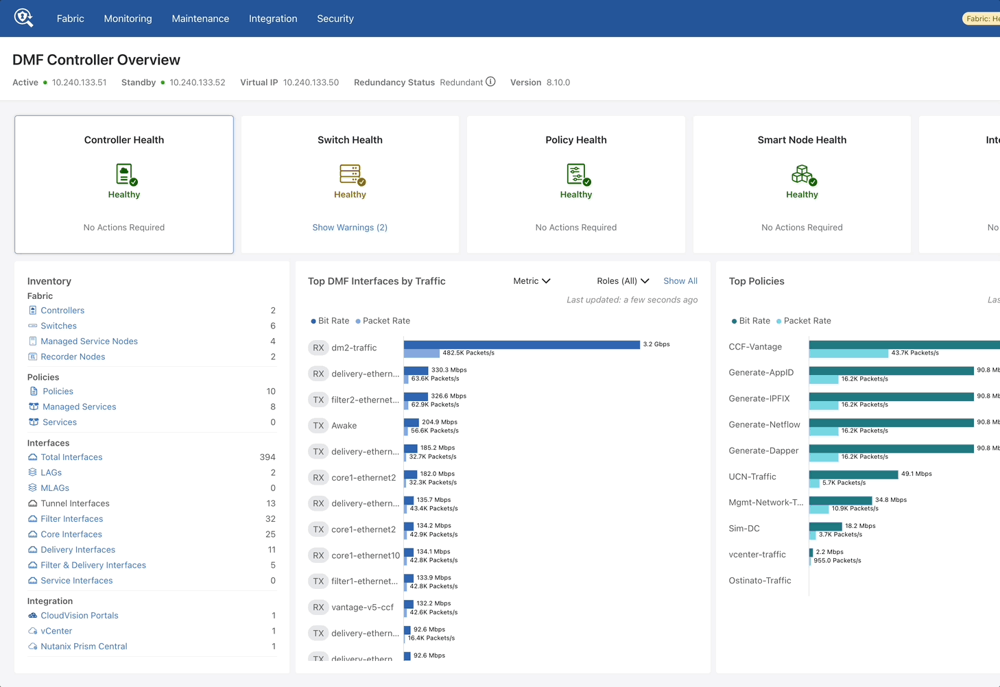
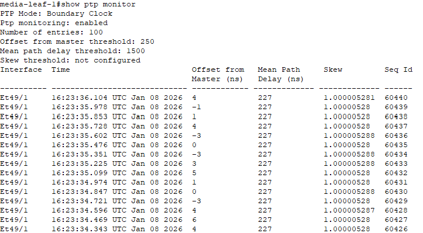
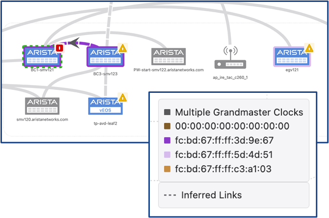
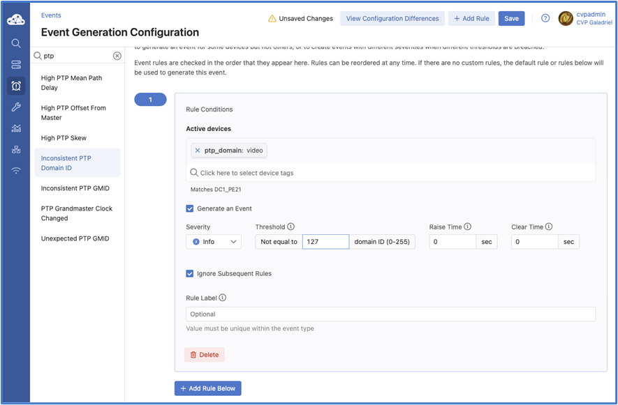
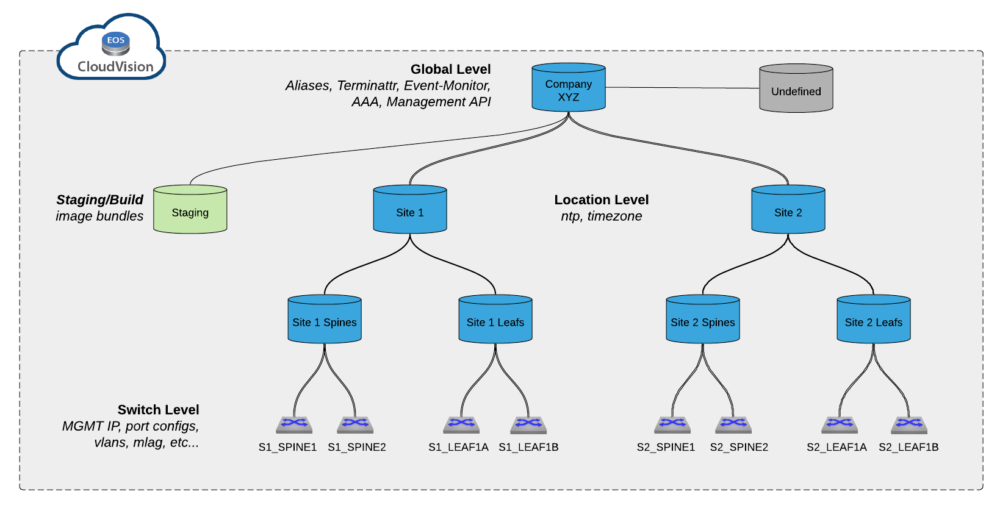
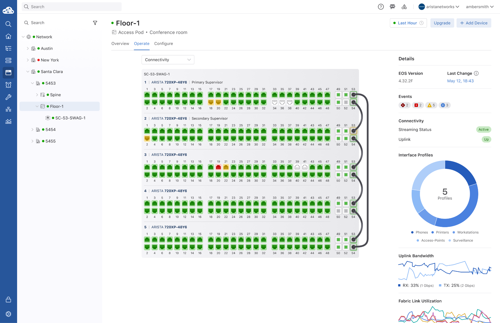
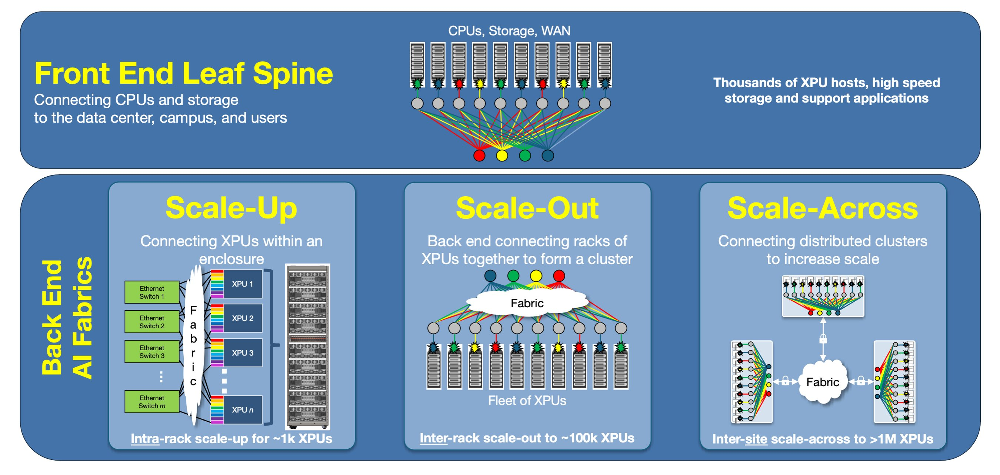
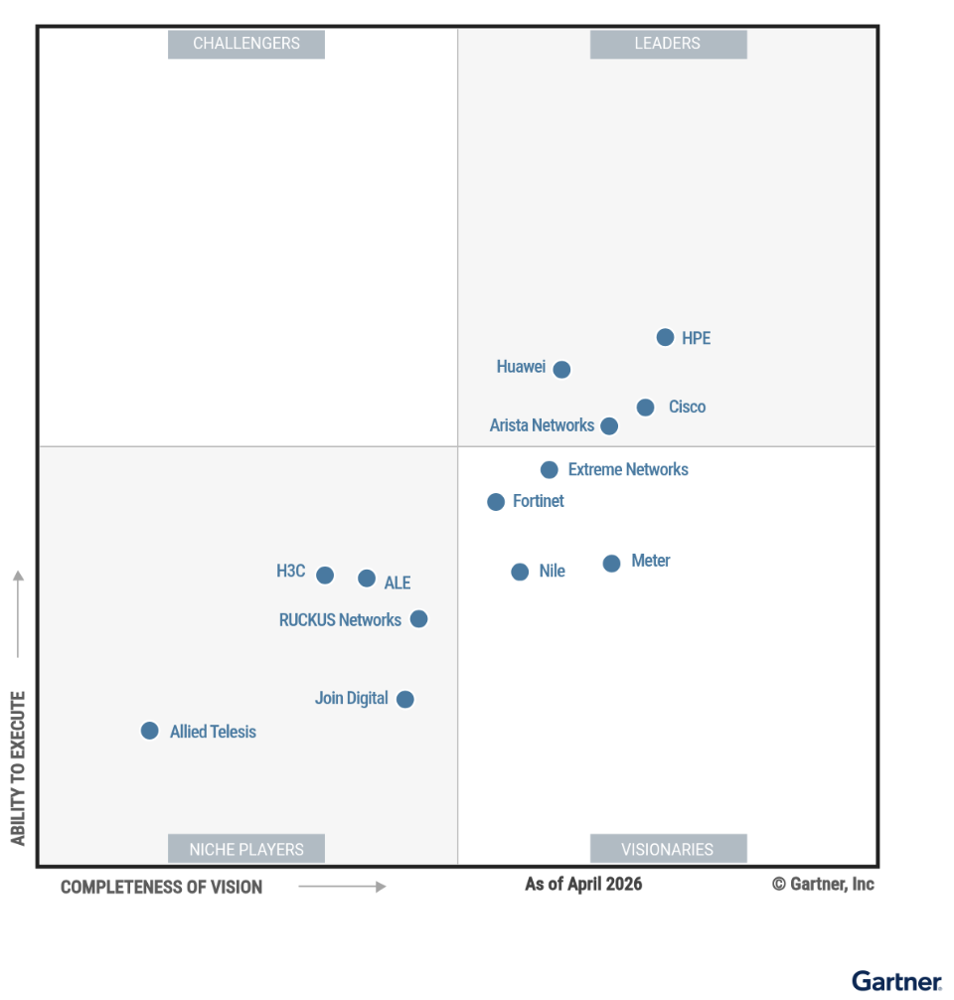

<!--
STAGING VARIANT v3: Hybrid edition of 2026.2 per team review feedback.
- Article 1 (DMF): Version 2 (author's original text) + the Partner
  Opportunities section from Version 1 (rewritten edition).
- Article 2 (IP Broadcast): Version 2 (authors' original text).
- Article 3 (CloudVision), Article 4, and all remaining sections:
  Version 1 (rewritten edition, content/2026.2).
Source images from the original docs live in assets/originals/.
-->

# Engineers' Exchange - Version 2026.2

  
  
Engineers sharing with engineers

*Published: June 2026 | Version 2026.2 | Q2 2026 Edition*

Welcome to **Engineers' Exchange Version 2026.2**! This quarterly edition brings you comprehensive technical updates - engineers sharing with engineers.

## 📰 In This Issue

- **Product Updates**: Deep technical dives into 4 cutting-edge technologies
- **Industry Spotlight**: Arista in the news and market trends
- **Upcoming Events**: Technical workshops and training sessions

---

## 🚀 Product Updates

This quarter, we're diving deep into four technologies that are transforming modern networks. Engineers sharing technical insights with engineers.

---

### 1️⃣ DANZ Monitoring Fabric: Wireshark Integration & the Combo Service Node

**✍️ Authors:** Brandon Mainock, Advisory Systems Engineer

**Overview**

I've had plenty of mentors in my career tell me the best way to learn is to suffer through the hard/old way because you'll appreciate the new tools, it builds character, and you'll have options for solving problems. Credit where credit is due, they were right. The suffering did teach me a lot and I'm grateful for it. Of course, I still reflect when seeing the latest and greatest advancements come out on my past endeavors where a past Brandon is fighting for his life thinking "Wow, that would have been super helpful 2 years ago". Anyways this article follows a similar vein where we will talk about clunky long workflows to make centralization an easier method. All culminating into one of my favorite network observability tools Arista has to offer…DANZ Monitoring Fabric (DMF). In this article I'll cover the addition of a wireshark instance on the DMF controllers and the service nodes adding recording services, exploring how workflows become more efficient and greater functionality is more obtainable than ever.

**Key Technical Highlights**

- **Wireshark on the controllers**: By no means is it new that DMF has a packet recorder node that can be integrated into a pure controller and switch deployment. The added feature set that you gain is the ability to query recorded packets via the recorder nodes dashboard in the DMF UI. These queries consist of
    - Window - Earliest and latest packet received on the recorder node
    - Size - Give the query parameters how much data are you expecting

    And of course…

    - Packet Data - This query type can be useful for creating pcaps given the parameters of your query.

However, now the script is being flipped. Rather than querying the recorder node and exporting the pcap from the DMF UI on to a local machine that would have wireshark on it, what if wireshark was there on the DMF UI along with your pcaps!?

- **The Combo node** DMF has also had advanced packet processing capabilities for a while as well. Offering flexible offerings of bandwidth and service use cases such as 40Gb of deduplication or 10Gb interfaces of 4 different services. What's new in the latest releases is the addition of a new type of service node that now has a 32Tb drive for packet recording functionality. All in all you get a combination of advanced packet processing and packet recording capabilities all in the same appliance.

**Platform Specifications**

**DMF Controllers - Appliance, VM, Public Cloud**

**DMF Controllers**: Are the central pane for all things DMF. Since DMF is a controller based architecture the management of fabric switches and the service/recorder nodes are all configurable and interactable from the Controller UI.

**Service Node With Recording Action**

**Service Nodes**: Much like ice cream services nodes have different flavors. Conveniently instead of the tough decision between macadamia nut vs lemon service nodes follow a linear scaling. From the lowest capacity 10Gbx4 to 25Gbx4 to finally the 100Gbx4. These devices can also be added to a DMF fabric in a very modular fashion IE pay as you grow. If more capacity is needed, simply purchase the service node amount you need and add it to the fabric. That being said, let's talk about the value of a service node and what exactly does "advanced packet processing" means.

We start with two terms:

- Actions: This is the comprehensive term for services that can be configured on an interface. Examples are AppID, Deduplication, or IPFIX record generation.
- Service Interface: These are the ports that are assigned the actions from above. Whether that is just one interface for a preferred service, or stacking multiple actions onto a single interface at the cost of some bandwidth.

**Technical Benefits**

**1. Wireshark on DMF Controllers**

- **Not watered down**: Mere moments after upgrading my DMF lab the first thing I checked was to see if the wireshark engineers have come to know and love had been put on guide rails with functionality limited to only viewing. I'm happy to report that everything from profiles and custom layout to the various windows required to view conversation have not been touched.
- **No more local device necessity**: One pain about creating and using pcaps on the recorder node prior to the wireshark integration was that to view the pcap you would have to export the pcap from the recorder node on a local machine to view it. This became an issue when the pcap in question was big, along with remote connectivity, creating long wait times for downloads. Of course all this working on the basis you had space on the machine you were exporting to to store the pcaps. With the addition of wireshark now the already created pcaps can be viewed without any exportation required. This cuts down on data usage for remote connectivity, storage and logistics of pcap storage and ultimately makes everything easier by finding all that uou need right on the controllers.

**2. Service node with recording action**

- **Huge win for smaller deployments**: One of the major values that DMF is known for is that it scales easily and cost effectively. Want more throughput? Add a switch or two. Want more packet recording? Add a recorder node or two. But let's flip the script and talk about the possibilities of the latter. What if you need a small deployment? If you wanted all the DMF functionality in a small deployment at minimum you'd have to have one switch (1RU), one controller (VM), a recorder node (2RU), and a service node (1RU). That's 4RU and a VM to get everything DMF has to offer for broad functionality. Now with the addition of the service node that can record we have one switch (1RU), 1 combo node (1RU) and a VM. That's 50% of the space savings to have the ability to do all features of years prior!
- **Work flows are easier than ever!**: With the addition of recording on the combo node being an action/service means that when creating policy data paths instead of adding a service to the policy and then adding a recorder node interface as a delivery, three parts in total. Now we can simply define our ingress ports and add services including the recording service. No delivery needed as the recording will terminate at the service node. In total now only two things to focus on when making policies for DMF!

**Partner Opportunities:**

- **Network Observability Refresh**: Position DMF upgrades to customers who rely on packet capture for security or troubleshooting — the Wireshark integration is a compelling, easy-to-demo improvement over legacy workflows
- **Consolidated Appliance Sales**: The Combo Node is a strong upsell for customers running separate service and recorder nodes, or a right-sized entry point for mid-market opportunities
- **Remote/Multi-Site Customers**: Customers with distributed teams or WAN-connected sites have an immediate pain point that the Wireshark-in-UI feature directly solves — use it to open the DMF conversation
- **Security-Focused Accounts**: Customers with SOC or incident response functions are natural targets for full DMF deployments; the Combo Node reduces the barrier to entry

**Resources:**

- DMF Service Node Breakdown: <a href="https://www.arista.com/en/hg-dmf/hg-dmf-dmf-service-nodes" target="_blank">DMF Service Nodes</a>
- DMF Product Page: <a href="https://www.arista.com/en/products/danz-monitoring-fabric" target="_blank">DANZ Monitoring Fabric</a>
- DMF Documentation: <a href="https://www.arista.com/en/support/toi/danz" target="_blank">DMF Technical Documentation</a>

---

### 2️⃣ The Arista Advantage in IP Broadcast

**✍️ Authors:** Ryan Morris, Media and Entertainment SME / Paul Mancuso, Systems Engineer

What typically comes to mind when you hear the phrase "media and entertainment"? Chances are, you picture major three-letter news stations, global sports franchises, or massive content delivery networks. However, the definition of a media and entertainment network has expanded far beyond these traditional boundaries. Today, a diverse range of verticals actively deploys robust IP broadcast capabilities. These capabilities support Fortune 500 enterprises, financial institutions, and houses of worship. Whether it involves facilitating remote education within the SLED sector, powering online training, or supporting critical video distribution in healthcare, high-quality media delivery is now a universal necessity.

Over the past decade, the distribution of video and audio content over IP networks has become commonplace, with major broadcasters paving the way by transitioning from traditional SDI to highly scalable SMPTE ST-2110 workflows. As organizations across various verticals embark on their own media distribution transformations, it is important to evaluate their infrastructure by asking: How is this IP migration being handled in the current environment, and how do we properly equip a network to deliver flawless video without dropping a single packet? Beyond core networking, what additional infrastructure components and features are required to ensure a streaming ecosystem operates with total cohesion?

Each element in the media stream has its own defined parameters and refers to each of them as an essence. The above image illustrates the individual essences that constitute a complete SMPTE ST-2110 signal. In this breakdown, each packet represents a unique essence, such as video, audio, or ancillary data. It is important to note that a single source can generate multiple streams for both the Audio and Ancillary signals.

To help assess a system's readiness, the following sections will explore the key pillars of Arista's Media and Entertainment portfolio—specifically Multicast Delivery, Precision Time Protocol (PTP) distribution, and Monitoring and Visibility—and explain why Arista remains the most reliable partner at the core of these critical industry deployments.

**Defining the Modern Media Network and Its Challenges**

The transition to network media workflows is driven by the industry-wide adoption of SMPTE ST-2110. Unlike traditional SDI formats, SMPTE ST-2110 breaks uncompressed signals into individual, unique multicast streams for video, audio, and ancillary data (such as closed captioning). While this provides incredible format flexibility and workflow agility, it modifies the underlying workflow of routing broadcast systems in a media environment - and the scale of the network.

Routing a single camera feed might require adjusting ten different multicast groups simultaneously, with video flows reaching up to 10.6 Gbps. Because traditional routing protocols like IGMP and PIM are completely unaware of network topology or link bandwidth, they can easily cause oversubscription and packet drops when multiple heavy video flows land on the same link. In live broadcast environments—where a single frame drop during a major sporting event or a critical healthcare stream can cost millions of dollars or compromise critical operations—these legacy protocols are often inadequate.

**The Arista Value: Pillars of IP Media Success**

The effectiveness of Arista's solutions in overcoming these obstacles is derived from a design philosophy established in the demanding realms of high-frequency trading and hyperscale cloud environments. In these sectors, unwavering reliability, balanced multicast distribution, and a necessity to completely prevent packet loss are fundamental necessities. Arista's structural superiority is founded on several core principles. Let's delve into them.

**Software Reliability and Advanced Multicast**: Arista understands that the primary requirements of an ST-2110 network—massive multicast scaling and Precision Time Protocol (PTP)—mirror the intense demands of the financial sector. Arista's Extensible Operating System (EOS) provides state-streaming capabilities and isolated software processes, ensuring fault isolation and network resilience even under the load of tens of thousands of multicast groups.

**Media Control Service (MCS)**: To solve the blind spots of IGMP and PIM, Arista developed the Media Control Service (MCS), a deterministic, network-aware orchestration middleware. MCS interacts directly with broadcast controllers to calculate bandwidth availability across the topology before routing. By programming the multicast forwarding information base (MFIB) in parallel across the fabric, MCS is not only significantly faster than traditional routing protocols while protecting links from oversubscription. Arista further eases the manageability of MCS through an easy-to-use API interface. Broadcast controllers integrate with this API interface to provision multicast flows required to support SMPTE ST2110, ST2022, AES67 and many other flow types.

Therefore, the key advantages of MCS include:

- Faster than traditional multicast routing protocols
- Bandwidth protection, from oversubscription and larger than expected flow provisioning
- Real-time notifications that broadcast controllers and other network monitoring tools can subscribe to - provides crucial information for system health and routing status of the media workflow

The following diagram illustrates Arista's software-defined architecture for modern IP media networks. On the left, third-party broadcast controllers and management platforms (like CloudVision) use Open APIs to communicate with Arista's Media Control Service (MCS). Acting as the intelligent orchestration brain, MCS performs "data-driven multicast flow provisioning" to calculate guaranteed bandwidth paths across the network. It then pushes these deterministic routing instructions through Arista's Extensible Operating System (EOS) directly into the underlying physical spine-leaf network fabric, seamlessly and reliably connecting the live media endpoints (cameras, audio feeds, and displays) shown at the bottom.

**Precision Time Protocol (PTP)**: Flawless media synchronization requires a robust PTP stack. Arista network switches support both Boundary and Transparent Clocks, but typically Boundary Clocks are selected in order to lock to an upstream Grandmaster and reliably distribute timing to endpoints. This architecture reduces reliance on complex routing while providing granular, real-time visibility into clock accuracy, offsets, and network delays directly within CloudVision.

Another advantage of deploying a Boundary Clock is the inherent flexibility. Media systems typically have hundreds of endpoints, and at times, some will require different PTP messaging rates. A Boundary Clock provides the ability to granularly adjust the messaging rates on a per interface level - where some may run on the SMPTE 2059-2 profile, and others will run on the AES67 profile. There is a common profile that accommodates both of the profiles referenced above - AESR16-2016 - and this is often used to provide the most coverage while maintaining a consistent messaging rate.

As shown in the following diagram, Arista switches configured in Boundary Clock mode offer a distinct advantage: they operate independently of multicast or unicast routing. By locking onto an upstream Grandmaster or another Boundary Clock, they efficiently distribute precision timing across all PTP-enabled interfaces. Users can easily configure settings globally or for each interface, but they must ensure consistent messaging rates between connected interfaces, particularly the announce interval.

The image above demonstrates two aspects. Firstly, PTP message transaction sent and received between switches and endpoint and displays the messaging for a switch configured as a boundary clock. Secondly, the image details the advantage of using Boundary Clock mode, there is flexibility in configuring message rates on a per interface basis. This granular control is particularly advantageous when integrating diverse endpoints that demand unique announcement intervals compared to the rest of the fabric. By tailoring message rates on a per-interface basis, Arista provides the necessary flexibility to support these specific device requirements without compromising the timing integrity of the broader media environment.

A key advantage in how Arista operationalizes Boundary Clocks in media networks is the significant visibility of Arista EOS and CloudVision in tracking the performance and events. One such event is the triggering of an election for a new Grandmaster by the Best Master Clock Algorithm (BMCA). Here are example values from EOS CLI.

**PTP Message Counters Per Interface (CLI)**

The Boundary Clock Per Interface Message Count event provides granular visibility into the volume of Precision Time Protocol (PTP) packets flowing across every individual switch port. Since PTP is a "chatty" protocol, an Arista switch acting as a Boundary Clock constantly exchanges messages (Announce, Sync, Follow-Up, Delay Request, and Delay Response) with attached cameras and monitors. This counter is crucial for monitoring system health: missing any of the messages described above can negatively affect a device's timing accuracy, with standard CLI providing insight data on a granular, per-interface detail of these values.

**Monitoring Accuracy of Boundary Clock compared to upstream GM**

The following images display how CloudVision (CVP and CVaaS) tools leverage streamed telemetry from Arista network switches to capture data on the monitoring accuracy of the Boundary Clock compared to the upstream Grandmaster (GM). This capability allows network operators to gain deep insight into real-time network performance and behavior by providing comprehensive PTP topology views, event-driven alarms, and the continuous streaming of PTP counters. Additionally, CloudVision's time-series database enables engineers to perform historical analysis on past timing fluctuations or systemic changes that have occurred across the fabric.

The graphic image shows how CloudVision can identify PTP problems and make the PTP architecture easier to grasp. This initial CVP graphic displays the CloudVision PTP Boundary Clock topology and which Grandmaster each Boundary Clock is locking to.

The Unexpected PTP GMID (Grandmaster ID) graphic and event alert in Arista CloudVision provides a critical security and stability safeguard for your network's timing infrastructure. This feature alerts network operators immediately if a switch starts taking its time synchronization from an unapproved or "rogue" clock source.

While the GMID alert ensures your switches are listening to the right hardware clock, the Inconsistent PTP Domain ID event ensures your switches are participating in the correct logical timing network altogether. In PTP, a "Domain" is an isolated grouping of clocks. For instance, a device configured for Domain 127 will completely ignore timing packets from Domain 119. This CloudVision event alerts network operators immediately if a switch's active PTP Domain ID does not match the expected Domain ID set in your operational rules. It is much more useful to receive information in this manner as opposed to a general PTP error alert.

The CloudVision Boundary Clock PTP Counter graphic provides highly granular, real-time visibility into the actual volume of Precision Time Protocol (PTP) packets flowing across every individual switch port.

To understand why this is so valuable, you have to remember that PTP is an incredibly "chatty" protocol. Remember our earlier discussion. An Arista switch acting as a Boundary Clock (BC) is constantly exchanging a very specific rhythm of multicast messages—Announce, Sync, Follow-Up, Delay Request, and Delay Response—with the cameras and monitors attached to it.

In a healthy SMPTE ST 2110 environment, a device receiving timing should request the time at a very predictable mathematical rate (e.g., sending Delay Requests 8 times a second). A sudden burst of thousands of requests spraying the network can overwhelm a switch's control plane. Conversely, a sudden absence of timing messages would indicate a silent failure. CVP can offer granular detail of these issues on a per interface specificity.

Comprehensive PTP topology views, event-driven alarms, and the continuous streaming of PTP counters provide operators with an unprecedented window into real-time network performance and behavior. Furthermore, leveraging CloudVision's time-series database, engineers can perform historical analysis to gain granular insight into past timing fluctuations or systemic changes that have traversed the fabric.

**Ecosystem Partnerships and Visibility**: Broadcasters often fear that migrating to IP will turn their infrastructure into a "black box." Arista mitigates this by partnering heavily with broadcast technology leaders like Evertz, EVS, Imagine Communications, Lawo, and Nevion for Broadcast Control applications and Providius and Skyline for Monitoring and Observability. By integrating deeply with these partners, Arista helps to reshape IP Media workflows to provide operators and engineers with data critical to understanding the minute by minute workflow changes.

**Dedicated Organizational Expertise**

Technology alone does not guarantee a successful IP migration; the people behind the architecture are a critical business driver. Arista's dedicated Media and Entertainment Working Group brings decades of combined, practical industry experience, with experts who have previously worked deep within television stations and major system integration firms. This extensive real-world broadcast knowledge is further solidified by the team's specialized industry patents—including patented innovations surrounding Media Control Service flow routing and management. This proven authority makes Arista not just a hardware vendor, but a seasoned consulting partner capable of guiding enterprises through complex ST-2110 migrations.

The CloudVision platform extends its value beyond real-time monitoring and visibility to serve as the unified, multi-domain control and automation plane for the entire media environment. Just as network engineers leverage CloudVision for consistent configuration management and Day 2 operations within Data Center and Campus environments, the same operational model applies seamlessly to M&E infrastructure. This consistency is the core value proposition of CloudVision's multi-domain approach: providing a single pane of glass for automated deployments, change control, and continuous telemetry across all segments—from core broadcast networks to enterprise-wide video distribution. By consolidating management across domains (DC, Campus, WAN/Branch, and Cloud), Arista significantly reduces operational complexity, streamlines network security, and enables faster troubleshooting through a consistent, single-platform architecture.

**Assessing the Infrastructure Readiness**

As media and entertainment workflows continue to expand into enterprise, education, and healthcare operations, it is imperative to evaluate the foundation of IP distribution. Based on the pillars outlined above, consider the following questions when reviewing the environment:

- Does the current network infrastructure actively prevent link oversubscription when routing massive uncompressed video flows?
- Do network and broadcast controllers share a unified, real-time view of network topology and bandwidth state?
- Is there a means for instant, actionable telemetry and tallies if a media flow fails or a PTP Grandmaster clock loses sync?

As a leading vendor of the industry's migration toward networked SMPTE ST-2110 workflows, Arista delivers the unwavering software reliability and advanced multicast capabilities required for modern media ecosystems. By leveraging the deterministic orchestration of Media Control Service (MCS) and a robust PTP stack utilizing Boundary Clock deployments, Arista ensures flawless synchronization and total infrastructure visibility. Arista is established as the premier partner for essential broadcast transitions through its extensive suite of tailored technologies and influential industry alliances. We are eager to support our channel partners as they undertake and execute new broadcast initiatives. For more information, please contact media-ent@arista.com

**Resources:**

- M&E Team Contact: [media-ent@arista.com](mailto:media-ent@arista.com)
- Arista M&E Solutions: <a href="https://www.arista.com/en/solutions/media-entertainment" target="_blank">Media and Entertainment Solutions Page</a>

---

### 3️⃣ The Next Evolution of Network Operations: CloudVision's Unified Hierarchy & Studio Orchestration

**✍️ Authors:** Drew Langin, Systems Engineer

*CloudVision's Multi-Domain Network Hierarchy — configuration is inherited top-down across Global, Location, and Switch tiers (Company XYZ → Site 1 / Site 2 → spines and leafs). This tag-based model is what the Static Configuration Studio uses in place of legacy configlet trees.*

**Overview**

Modern network operations are increasingly defined by multi-domain environments that span the campus, data center, and wide-area network (WAN). Managing these distinct environments has historically required segregated toolsets, varying automation methodologies, and highly specialized CLI skills. This article examines the recent structural updates to Arista CloudVision, focusing on the convergence of Day 0 through Day 2 operations into a unified network hierarchy. We look at the migration from legacy container-based provisioning to template-free abstraction engines (Studios), the operationalization of graphical front-panel diagnostics for campus environments, and the implementation of automated, compliance-safe workspace workflows.

**Key Technical Highlights:**

- **Multi-Domain Network Hierarchy**: A single EOS software baseline projects campus, data center, and WAN into one dashboard, merging telemetry and active provisioning into a unified top-down view — from a global map down to the individual transceiver port.
- **Studios Orchestration**: The decade-old legacy Network Provisioning app (static configlet-tree inheritance) is being phased out in favor of Studios — a template-free abstraction layer built directly on Arista Validated Designs (AVD), with a one-click Guided Migration Tool to convert existing configlet trees into tags.
- **Campus Guided Onboarding**: Zero-Touch Provisioning (ZTP) abstracted into point-and-click workflows, with real-time LLDP topology validation, dynamic host-naming, and automated subnet/IPAM allocation.
- **Front-Panel Diagnostics & Virtual Stacking**: Physical stacks, MLAG pairs, and Switch Aggregation Groups (SWAG) aggregate into a single Virtual Stack View, with standardized Port Profiles plus in-UI TDR cable tests and interface/PoE cycling.
- **Workspaces & Compliance**: Every change is gated by transactional dry-run validation, side-by-side compliance diffs, RBAC-driven Change Control, and full audit logging — surfaced through the persistent Workspace Island.
- **Telemetry & Extensibility**: The Request Recorder turns UI actions into production-ready Python, and time-block event widgets bucket streaming anomalies for instant drill-down.

**Architectural Deep Dive:**

**1. Architectural Convergence: Multi-Domain Network Hierarchy**

A primary challenge in enterprise networking is bridging the operational gap between highly structured data centers and heterogeneous, dynamic campus topologies. CloudVision addresses this by leveraging a single Extensible Operating System (EOS) software baseline across all platforms, projecting a Multi-Domain Network Hierarchy View within a single dashboard. Unlike legacy platforms that separate real-time monitoring from state configuration, this architecture merges telemetry and active provisioning into one unified view — enabling a top-down approach that lets engineers drill down from a global multi-domain map into regional pods, specific buildings, individual switch stacks, and down to the physical transceiver port level.

**2. Day 0/1 Provisioning: Guided Onboarding & Studios Abstraction**

Manual configuration of campus access layers introduces high human-error rates and prolonged deployment times. CloudVision mitigates this through Campus Guided Onboarding Workflows that abstract ZTP into automated point-and-click operations.

- **Pre-Provisioning Topology Validation**: As unconfigured hardware boots in ZTP mode, the guided workflow auto-discovers neighbor links via LLDP and maps the prospective topology *before* applying configuration scripts — eliminating the "flying blind" problem of cabled-but-unconfigured switches.
- **Algorithmic Parameter Generation**: Operators define an organizational naming-convention prefix and the orchestration layer dynamically sequences and generates hostnames across large device batches. In-band management subnets and VLAN variables are declared globally at the campus or pod tier, and the system automatically carves out the next available IP from that block — eliminating manual IPAM tracking errors.
- **The Evolution to Studios**: The legacy Network Provisioning app (static hierarchical configlet inheritance) is being structurally phased out in favor of Studios.

> Legacy Network Provisioning (Configlet Trees) → Migrated via Tool → Static Configuration Studio (Tag-Based)

Studios operate as an abstraction layer directly on top of Arista Validated Designs (AVD). Rather than forcing engineers to write rigid CLI fragments, they compile declarative inputs into validated, rendered configurations. For environments with deeply entrenched configlet architectures, the one-click Guided Migration Tool ingests the entire legacy container tree, preserves existing image bundles and configlets, maps them into tags, and rebuilds them inside the Static Configuration Studio and Software Management Studio natively.

**3. Day 2 Operations: Abstracted UI Workflows & Hardware Diagnostics**

Campus operators and field engineers are frequently task-focused — toggling ports, reassigning VLANs, troubleshooting physical-layer issues — rather than dedicated CLI specialists. To optimize these workflows, CloudVision introduces graphical front-panel and virtual-stack orchestration engines.

*The graphical Virtual Stack View aggregates a five-member 720XP SWAG stack into a single front-panel object — per-port status, interface profiles, and live telemetry (EOS version, events, uplink bandwidth) all in one pane.*

- **Port Profiles & Virtual Stacking**: Rather than evaluating switches as isolated nodes, CloudVision aggregates multi-switch clusters — physical stacks, MLAG pairs, or SWAG pods — into a single Virtual Stack View. Interfaces are managed via standardized Port Profiles defined within Studios, where a profile wraps a complete configuration state (native VLAN, trunking mode, descriptions, PoE priorities) into a single object. Applying it across many physical ports generates one background configuration delta, abstracting the underlying syntax entirely.
- **Automated Hardware Diagnostics**: To accelerate Mean Time to Resolution (MTTR), low-level EOS diagnostics are exposed directly in the front-panel UI. **Time-Domain Reflectometry (TDR) cable tests** query the underlying EOS layer and render a visual breakdown of each twisted pair with an exact distance-to-fault metric in meters (note: this disrupts link-state traffic). **Interface Cycle Testing** exposes two software execution loops — an Administrative Cycle (`shutdown`/`no shutdown`) to force link renegotiation, and a PoE Cycle that drops and restores inline power to remotely reboot downstream endpoints without resetting the switch.

**4. Continuous Integration & Compliance: Workspaces and Telemetry**

Every structural change inside CloudVision is gated by a robust transactional safety mechanism designed to ensure compliance and audit trails.

*The Workspace Island — a persistent staging modal for drafting, validating (dry-run), and submitting workspaces. Once submitted, changes flow to Change Control for approval and execution.*

- **The Workspace Island**: A persistent modal staging environment that eliminates the page navigation historically required when reviewing bulk changes. Workspaces act as isolated sandboxes where configuration deltas are verified via dry-run compilations, with clear side-by-side diff views showing exactly how running configs and software images will shift. During software verification, the platform references live upgrade streams to inject **Intelligent EOS Lifecycle Banners** — if an engineer stages an outdated version, the system flags the latest validated maintenance release to mitigate known bug exposure.
- **Differentiated Change Control**: An **Asynchronous Manual Review** path handles standard modifications (e.g., Port Profile reassignments) — the operator submits the workspace, triggering a formal Change Control window bound by RBAC and scheduling constraints. A **Synchronous Automated Review** path handles quick diagnostic overrides (TDR tests, PoE resets) — CloudVision spins up an ephemeral workspace behind the scenes, executes a targeted Change Control, log-records the transaction, and tears the workspace down automatically once complete.
- **Telemetry & Extensibility**: The **Request Recorder** transparently intercepts and logs the exact REST API calls and JSON payloads the UI sends to the server, letting engineers reverse-engineer UI interactions into production-ready Python without wading through API docs. **Time-Block & Threshold Event Widgets** aggregate streaming anomalies into graphical time-block matrices — a spike in errors flips a block to a warning state, letting engineers click straight into the exact time-slice for streaming metrics.

**The Bottom Line**

These updates show a deliberate evolution toward an abstract, highly automated network operating model. By combining campus, WAN, and data center domains into a cohesive hierarchy and shifting provisioning logic entirely to Studios, CloudVision eliminates legacy operational barriers. Stripping away traditional CLI overhead through front-panel diagnostics, Port Profiles, and automated workspace validation minimizes human error — enabling consistent, verified change management across the entire network footprint.

**Partner Opportunities:**

- **Campus Modernization & Migration**: Customers with large, entrenched legacy configlet trees are ideal candidates for the one-click Studios Guided Migration — a low-risk, high-value modernization conversation.
- **Lean IT / Operational Simplification**: Front-panel diagnostics (TDR, interface/PoE cycling) and Port Profiles reduce CLI dependency, making CloudVision a strong fit for accounts without deep network-engineering benches.
- **Compliance-Driven Accounts**: Workspaces, dry-run validation, RBAC Change Control, and full audit logging map directly to regulated industries' change-management requirements.
- **Automation & DevOps Upsell**: The Request Recorder is a natural hook for automation services — turning UI workflows into Python opens the door to broader NetDevOps engagements.

**Resources:**

- Source: CloudVision Chats Ep. 5 — "Christmas Special: A Lookback on 2025 and Our Favorite Features"
- CloudVision Product Page: <a href="https://www.arista.com/en/products/eos-cloudvision" target="_blank">Arista CloudVision</a>

---

### 4️⃣ The Many Facets of AI Fabrics

**✍️ Recognition:** Re-imagined for partners from the original authors' blog 

*As we enter the generative AI era, the network has become the elastic backplane of AI infrastructure — the fabric that defines the efficiency of AI itself*

**Overview**

As computational resources scale to meet the demands of large generative AI models, networking plays a crucial role in improving the utilization of precious cycles from accelerator processing units (XPUs). The network has become the governor of AI performance — every stalled packet, every microsecond of congestion, translates directly to loss of revenue. Conversely, well-optimized networks unlock latent AI performance across distributed XPU systems. In a world of trillion-parameter models and real-time inference, the efficiency of the network defines the efficiency of AI itself. This article reviews the three key network strategies used to connect and scale AI accelerators — **Scale-Up**, **Scale-Out**, and **Scale-Across** — and how Arista unifies them into a single AI Fabric.

**Key Technical Highlights:**

- **Scale-Up (Intra-Rack)**: Non-blocking, low-latency interconnect of XPUs within a single rack for shared memory coherency — enabled by liquid cooling for density and co-packaged copper/optics (CPC/CPO), with Ethernet Scale-Up Networking (ESUN) on a 200G SerDes foundation as an open alternative to proprietary interconnects.
- **Scale-Out (Inter-Rack)**: Horizontal scaling across racks in a flat two-tier leaf-spine fabric; massive radix maximizes reachable XPUs while preserving bisection bandwidth, with topology-aware Cluster Load Balancing (CLB) replacing static routing.
- **Scale-Across (Inter-Site)**: Interconnects physically separated AI clusters over distance via integrated internet, storage, WAN, and optical layers — using hierarchical deep buffers and SRv6 micro-segment (uSID) routing to absorb transient congestion and micro-bursts.
- **AI Etherlink™ Platforms**: Optimize the Multipath Reliable Connection (MRC) protocol via hardware-accelerated packet trimming and intelligent buffering to minimize tail latency.
- **Multi-Planar Orchestration**: Isolates traffic across independent fabric planes for deterministic performance and increased resiliency.
- **7800 AI Spine**: A high-radix spine layer for metro-mesh topologies, offloading inter-cluster traffic and leveraging SRv6 for stateless, end-to-end routing across geographically dispersed sites.

*Networking for the AI Center: a Front End Leaf Spine connects CPUs, storage, and users, while the Back End AI Fabrics scale up (intra-rack, ~1k XPUs), out (inter-rack, ~100k XPUs), and across (inter-site, >1M XPUs)*

**The Three AI Fabric Strategies:**

**1. Scale-Up — High-Speed XPU Interconnect, Intra-Rack**

Vertical XPU scaling interconnects multiple compute nodes within a single rack using non-blocking, low-latency switches to achieve shared memory coherency. Workloads distributed across multiple XPUs in the same rack can access unified memory as a single giant pool, coordinating via non-blocking all-to-all communications. The advantage is simplicity — localized computation and high computational density. Modern designs improve XPU density through liquid cooling (reducing heat and power) complemented by low-power, high-bandwidth interconnects like co-packaged copper/optics. This close-knit integration means a single interconnect link failure or memory error can stall the whole node, requiring appropriate collective controls within the scale-up fabric.

**2. Scale-Out — High-Speed XPU Interconnect, Inter-Rack**

Scale-out (horizontal) scaling adds more machines, moving workloads across multiple servers or nodes and connecting storage, general-purpose CPUs, and WAN. These dual-mode systems traverse both east-west and north-south patterns, making them ideal for distributed training and inference parallelized across nodes. Scale-out efficiency is driven by network topology economics: by leveraging massive radix, operators maximize the number of XPUs reachable in a flat two-tier leaf-spine network — maintaining bisection bandwidth without the penalty of an extra tier of transceivers and fiber in power-conscious AI centers.

**3. Scale-Across — AI Performance Across Distance and Locations**

Scale-across expands across multiple datacenters by interconnecting physically separated AI clusters or pods over large distances, letting training jobs span a massive number of XPUs and pooling geographically distributed resources for frontier models. This requires robust infrastructure integrating internet, storage, WAN, and optical layers through complex routing and hierarchical deep buffers to absorb the transient congestion and micro-bursts inherent in distributed AI workloads. Advanced traffic engineering, robust encryption, and sophisticated routing keep AI compute clusters resilient and secure across multiple tenants.

**The Next Frontier — Unified AI Fabrics**

With the relentless growth of AI workloads, the industry is moving beyond isolated, single-purpose networks toward unified AI fabrics that transform classic leaf-spine architectures into intelligent, multi-fabric systems synchronizing scale-up, scale-out, and scale-across. This paradigm converges the deterministic, RDMA-driven performance required for scale-out clusters with the metro-scale traffic steering needed for distributed deployments. By harmonizing hardware and software networking, customers get the economic simplicity of a two-tier design while scaling from thousands to millions of AI accelerators. The optimization of the MRC protocol — combined with SRv6 uSID support in EOS® — minimizes tail latency and enables fine-grained, source-routed steering, while multi-planar orchestration isolates traffic across independent fabric planes.

**One Consistent, Resilient Architecture**

More than a decade ago, Arista pioneered the Universal leaf-spine (CLOS) architecture to replace rigid, oversubscribed three-tier data center networks. Traffic patterns have since shifted from strictly east-west to massive, synchronized all-to-all and all-reduce bursts for AI training and inference, while bandwidth demands explode from 112G SerDes to 224G and soon 448G per lane. Modern AI centers must simultaneously cope with the synchronous elephant flows of massive training and the low-latency, concurrent swarms of real-time inference — conditions where static topologies suffer hotspot jitter that slows Job Completion Time (JCT) or increases Time to First Token (TTFT). Adaptive AI fabrics across L1/L2/L3, implemented as multi-planar designs, overcome these slowdowns and deliver one consistent, resilient architecture for the age of agentic AI.

**Partner Opportunities:**

- **AI/ML Infrastructure Buildouts**: Position the Etherlink portfolio and 7800 AI Spine for customers standing up GPU/XPU clusters — the Scale-Up/Out/Across framework is a clear, consultative way to map customer scale to architecture.
- **Open Ethernet vs. Proprietary Fabrics**: ESUN and standards-based Ethernet are a strong differentiator for accounts wary of proprietary scale-up interconnects.
- **Multi-Site / Metro AI**: Scale-Across with SRv6 uSID addresses customers distributing training across datacenters — a high-value WAN/optical + datacenter conversation.
- **Performance Optimization**: Lead with the business case — reduced JCT and TTFT directly translate to better XPU utilization and ROI on expensive accelerators.

**Resources:**

- Source: <a href="https://blogs.arista.com/blog/the-many-facets-of-ai-fabrics" target="_blank">"The Many Facets of AI Fabrics" — Arista Blog</a> (Jayshree Ullal and Hardev Singh, May 2026)
- Arista AI Networking Solutions: <a href="https://www.arista.com/en/solutions/ai-networking" target="_blank">arista.com/en/solutions/ai-networking</a>

---

## 📊 Industry Spotlight

### Arista Networks Positioned as a Leader in the 2026 Gartner® Magic Quadrant™ for Enterprise Wired and Wireless LAN

*Source: Gartner® Magic Quadrant™ for Enterprise Wired and Wireless LAN, as of April 2026 — Arista Networks positioned in the Leaders quadrant*

**Overview**

From the beginning our vision for the "Cognitive Campus" has been a unified architecture built on the rock-solid foundation of a single Extensible Operating System (EOS®) and real-time state streaming. Just as we revolutionized cloud and data centers, our customers have embraced this modern approach to campus networking.

Our ongoing commitment to innovation and customer success has led to a significant milestone in 2026: **Arista Networks has been recognized as a Leader in the 2026 Gartner Magic Quadrant for Enterprise Wired and Wireless LAN.**

---

**How We Got Here**

*The Cognitive Campus journey — from a single EOS binary and two-tier leaf-spine foundation to a zero-trust, AIOps-driven, AI-driven edge*

**Phase 1 — 2018–2021: Foundation Blueprint**

Arista replaced complex three-tier designs with a two-tier "Leaf Spline Edge Architecture." The 2018 Mojo Networks acquisition added controllerless Cognitive Wi-Fi with a distributed edge control plane, enabling cloud-scale AP management and seamless integration into the EOS Campus fabric.

By extending a single EOS binary from core to edge and utilizing CloudVision®, Arista unified management. Applying Arista Validated Designs (AVD) and Smart System Upgrades (SSU) minimized operational silos and maintenance overhead while ensuring architectural consistency across switch types.

**Phase 2 — 2022–2024: Zero Trust Product Expansion Era**

We expanded our campus portfolio with the 700 series leaf switches and 7050 series spines, offering high-density PoE/non-PoE and scalability. This period introduced AI/ML via Arista's NetDL™, enabling automated, conversational troubleshooting that proactively identifies issues.

To secure the distributed campus, we integrated zero-trust security into the fabric via Macro-Segmentation Services (MSS). We addressed the complexity of traditional NAC by launching Arista Guardian for Network Identity (CV AGNI™), a cloud-delivered microservices architecture for users, endpoints, and IoT. By combining MSS, AGNI, and Network Detection and Response (NDR), the network can now autonomously detect and quarantine threats.

**Phase 3 — 2025–2027: Capability and Platform Expansion with AIOps Innovation**

We pioneered a modern approach to campus stacking with our Switch Aggregation Group (SWAG™) capability in Arista EOS. Alongside this, we introduced CloudVision® Leaf Spine Stack (LSS™) Management for unified provisioning.

In 2025, we aggressively evolved our integrated branch and SD-WAN architecture with the VeloCloud acquisition.

Now in 2026, we are introducing ruggedized switches built for extreme environments, paired with a Wi-Fi 7 access point featuring built-in, internal directional antennas delivering seamless wireless to high-ceiling warehouses, manufacturing hubs, and outdoor spaces where traditional connectivity struggles.

Finally, Arista launched AVA® (Autonomous Virtual Assist), a unified agentic AI framework for networking. Using an open EOS interface and the Model Context Protocol (MCP), AVA enables AI agents to reason and perform multi-domain event correlation across wired, wireless, data center, and security environments. Powered by real-time NetDL data, AVA acts as a proactive digital engineer, providing continuous monitoring and conversational troubleshooting to instantly resolve root causes with a human-in-the-loop model.

---

We are honored to be named a Leader in the 2026 Gartner Magic Quadrant for Enterprise Wired and Wireless LAN. We believe strongly in what we are doing here at Arista. This distinction, along with our relentless desire to execute for our customers, validates our momentum in delivering the same modern, rock-solid, and AI-optimized connectivity that transformed the data center, to the campus.

**Resources:**

- Complimentary copy of the report: <a href="https://solutions.arista.com/gartner-2026-wired-wireless-mq" target="_blank">2026 Gartner Magic Quadrant for Enterprise Wired and Wireless LAN</a>
- Cognitive Campus portfolio: <a href="https://www.arista.com/en/solutions/cognitive-campus" target="_blank">arista.com/en/solutions/cognitive-campus</a>

<small>

Gartner, Magic Quadrant for Enterprise Wired and Wireless LAN, By Mike Leibovitz, Christian Canales, Tim Zimmerman, 18 May 2026

Gartner does not endorse any vendor, product or service depicted in its research publications and does not advise technology users to select only those vendors with the highest ratings or other designation. Gartner research publications consist of the opinions of Gartner's research organization and should not be construed as statements of fact. Gartner disclaims all warranties, expressed or implied, with respect to this research, including any warranties of merchantability or fitness for a particular purpose.

Gartner and Magic Quadrant are trademarks of Gartner, Inc., and/or its affiliates.

</small>

---

## 📅 Upcoming Events

### Events

**Live Online Tech Enablement - Streamline Your Wireless Network**

**Date**: Ongoing webinar

**Location**: Zoom Online

**Registration**: <a href="https://solutions.arista.com/en/wi-fiweb2-0?utm_source=website&utm_medium=wifi_overviewLink" target="_blank">Register Here</a>

---

**Arista Partner Events - Global Event Calendar**

**Date**: Ongoing webinar and onsite events

**Location**: Zoom Online and city near you

**Registration**: <a href="https://events.arista.com/events-calendar" target="_blank">View Calendar</a>

---

**TAC Webinar Series**

**Date**: Ongoing series

**Location**: Zoom Online

**Registration**: <a href="https://events.arista.com/tac-webinar-series" target="_blank">Register Here</a>

---

## 🎓 Arista Learning Tools

### Learning Resources

**Arista Labs**

**Description**: Hands-on lab environment for testing and learning

**Access**: <a href="https://labs.arista.com/users/login" target="_blank">Login to Arista Labs</a>

---

**Arista Academy**

**Description**: Comprehensive training and certification platform

**Access**: <a href="https://academy.training.arista.com/learn" target="_blank">Login to Arista Academy</a>

---

## 📞 Contact Information

**Newsletter Team**

Email: [cse-newsletter@arista.com](mailto:cse-newsletter@arista.com)

**Partner Support**

Email: [partners-techhelp@arista.com](mailto:partners-techhelp@arista.com)

Portal: <a href="https://partners.arista.com" target="_blank">partners.arista.com</a>

---

*Thank you for being a valued partner. We look forward to continued success together!*

## 📋 Newsletter Schedule

- **Publishing Schedule**: Quarterly (every 3 months)
- **Next Issue**: Q3 2026 (September) - Publishing 2nd week of September 2026

### 2026 Quarterly Schedule
- **Q1 2026**: March (2nd week) - Published
- **Q2 2026**: June (2nd week) - Current Issue
- **Q3 2026**: September (2nd week)
- **Q4 2026**: December (2nd week)
