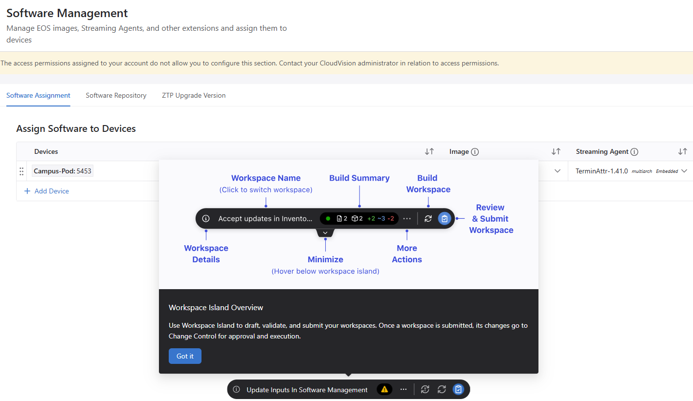

# The Next Evolution of Network Operations: A Deep Dive into CloudVision's Unified Hierarchy and Studio Orchestration

**✍️ Authors:** Drew Langin, Systems Engineer

## Abstract

Modern network operations are increasingly defined by multi-domain environments that span the campus, data center, and wide-area network (WAN). Managing these distinct environments has historically required segregated toolsets, varying automation methodologies, and highly specialized CLI skills. This paper examines the more recent structural architecture updates to Arista CloudVision, focusing on the convergence of Day 0 through Day 2 operations into a unified network hierarchy. We analyze the migration from legacy container-based provisioning models to template-free abstraction engines (Studios), the operationalization of graphical front-panel diagnostics for campus environments, and the implementation of automated, compliance-safe workspace workflows.

## 1. Architectural Convergence: Multi-Domain Network Hierarchy

A primary architectural challenge in enterprise networking is bridging the operational gap between highly structured data centers and heterogeneous, dynamic campus topologies. CloudVision addresses this by leveraging a single Extensible Operating System (EOS) software baseline across all platforms, projecting a Multi-Domain Network Hierarchy View within a single dashboard.

Unlike legacy management platforms that separate real-time monitoring from state configuration, this architecture merges telemetry and active provisioning into a single, unified view. This enables a topological top-down approach, allowing engineers to drill down from a global multi-domain map into regional pods, specific buildings, individual switch stacks, and down to the physical transceiver port level.

## 2. Day 0/1 Provisioning: Guided Onboarding & Studios Abstraction

Manual configuration of campus access layers introduces high human-error rates and prolonged deployment times. CloudVision mitigates this through specialized Campus Guided Onboarding Workflows that abstract Zero-Touch Provisioning (ZTP) into automated point-and-click operations.

### 2.1 Pre-Provisioning Topology Validation

A common issue during ZTP deployments is "flying blind" when switches are unconfigured but physically cabled. CloudVision's guided onboarding workflow integrates a real-time, interactive topology engine. As unconfigured hardware boots in ZTP mode, the system auto-discovers neighbor links via Link Layer Discovery Protocol (LLDP) and maps the prospective topology before applying configuration scripts.

### 2.2 Algorithmic Parameter Generation

To scale bulk deployments, the provisioning layer eliminates repetitive data entry through programmatic automation:

- Dynamic Host naming: Operators define an organizational naming convention prefix; the orchestration layer dynamically tracks, sequences, and generates hostnames across large device batches simultaneously.
- Automated Subnet Allocation: In-band management subnets and corresponding VLAN variables are declared globally at the campus or pod tier. When an access switch is added, the system automatically carves out and binds the next available IP address from that designated management block, eliminating manual IP address management (IPAM) tracking errors.

### 2.3 The Evolution to Studios Orchestration

A key paradigm shift in CloudVision's configuration lifecycle is the structural phase-out of the decade-old legacy Network Provisioning app (which relied on static hierarchical configlet inheritance) in favor of modern Studios architecture.

> Legacy Network Provisioning (Configlet Trees) ──► Migrated via Tool ──► Static Configuration Studio (Tag-Based)

Studios operate as an abstraction layer directly on top of Arista Validated Designs (AVD). Rather than forcing engineers to write rigid CLI fragments, it compiles declarative inputs into validated, rendered configurations. For enterprise environments with deeply entrenched configlet architectures, CloudVision introduced a one-click Guided Migration Tool. This tool ingests the entire legacy container tree, preserves existing image bundles and configlets, maps them into tags, and rebuilds them inside the Static Configuration Studio and Software Management Studio natively.

## 3. Day 2 Operations: Abstracted UI Workflows & Hardware Diagnostics

Campus operators and field engineers are frequently task-focused (e.g., toggling ports, VLAN reassignment, troubleshooting physical layer issues) rather than being dedicated CLI specialists. To optimize these operational workflows, CloudVision introduces graphical front-panel and virtual-stack orchestration engines.

### 3.1 Port Profiles and Virtual Stacking

Rather than evaluating switches as isolated nodes, CloudVision aggregates multi-switch clusters—whether bound by physical stacking, MLAG pairings, or Switch Aggregation Groups (SWAG)—into a single unified Virtual Stack View.

> [Physical Switches / MLAG Pairs / SWAG Pods] ──► Aggregated Telemetry ──► Graphical Virtual Stack View

Operators manage interfaces via standardized Port Profiles defined within Studios. A profile wraps a complete configuration state—including native VLAN assignments, trunking modes, port descriptions, and Power over Ethernet (PoE) priorities—into a single object. Applying this profile to multiple physical ports across different hardware pods generates a single background configuration delta, abstracting the underlying syntax entirely from the user.

### 3.2 Automated Hardware Layer Diagnostics

To accelerate Mean Time to Resolution (MTTR), CloudVision exposes low-level EOS diagnostic capabilities directly within the front-panel interface, automating two primary troubleshooting functions:

- Time-Domain Reflectometry (TDR) Cable Tests: Operators can select suspect copper interfaces and execute a live cable health test. The system queries the underlying EOS layer, runs the diagnostic, and renders a visual breakdown of each twisted pair, calculating the exact distance-to-fault tracking metric in meters. Note: This diagnostic disrupts link-state traffic.
- Interface Cycle Testing: To remediate stuck end-devices or faulty link-states, the UI exposes two software execution loops. The Administrative Cycle triggers a programmatic shutdown / no shutdown sequence to force link renegotiation. The PoE Cycle drops and restores inline power to the hardware pins without resetting the switch itself, enabling a hard remote reboot of downstream endpoints.

## 4. Continuous Integration & Compliance: Workspaces and Telemetry

Every structural change inside CloudVision is gated by a robust transactional safety mechanism designed to ensure compliance and audit trails.

### 4.1 The Workspace Island and Pre-Deployment Validation

To minimize operational fatigue, the platform utilizes a UI design paradigm known as the Workspace Island. This component acts as a persistent modal staging environment, eliminating the browser page navigation historically required when reviewing bulk changes.

> [Configuration / Image Changes] ──► Workspace Island Staging ──► Automated Dry-Run Validation ──► Compliance Delta (Diff) Review ──► Change Control Execution

Workspaces serve as isolated sandboxes where configuration deltas are verified via "dry-run" compilations. The Workspace Island provides clear side-by-side cryptographic diff views showing precisely how running configurations and software images will shift across the network infrastructure.

Furthermore, during the software verification phase, the platform references live upgrade streams to inject Intelligent EOS Lifecycle Banners. If an engineer stages an outdated or lower-tier software version, the system auto-analyzes the active train and alerts the operator to upgrade directly to the latest, heavily validated maintenance release, mitigating known bug exposure.

### 4.2 Differentiated Change Control Execution Paths

Once validated, changes follow one of two programmatic paths down to the hardware layer:

- Asynchronous Manual Review: Standard infrastructure modifications (such as Port Profile reassignments) populate an open workspace. The operator manually submits the workspace, triggering a formal Change Control window that adheres to strict organizational Role-Based Access Control (RBAC) and scheduling constraints.
- Synchronous Automated Review: Quick diagnostic overrides (such as TDR cable tests or PoE resets) bypass manual workspace staging. CloudVision automatically spins up an ephemeral workspace behind the scenes, executes a targeted Change Control, applies the running configuration modification, log-records the transaction for audit compliance, and tears down the workspace automatically once the test concludes.

### 4.3 Advanced Telemetry Logging & Developer Extensibility

For security auditing and compliance tracking, CloudVision introduced telemetry and developer enhancements focused on total transparency:

- The Request Recorder: An embedded diagnostic utility designed for network automation engineers and TAC investigations. When active, it transparently intercepts and logs the exact REST API calls and JSON payloads that the CloudVision UI passes back to the central server. This allows engineers to easily reverse-engineer UI interactions into production-ready Python automation scripts without navigating complex API documentation.
- Time-Block & Threshold Event Widgets: Moving away from standard rolling text logs, streaming state anomalies are aggregated into graphical time-block matrices. Network events are bucketed by time intervals and threshold counts; a sudden spike in errors converts specific blocks to a warning state, allowing engineers to click straight into the exact millisecond time-slice to pull streaming state metrics instantly.

## 5. Conclusion

The more recent updates to Arista CloudVision show a deliberate evolution toward an abstract, highly automated network operating model. By combining campus, WAN, and data center domains into a cohesive hierarchy and shifting provisioning logic entirely to Studios, the platform eliminates legacy operational barriers. Furthermore, stripping away traditional CLI overhead through front-panel diagnostics, port profiles, and automated workspace validation minimizes human error. This enables enterprise organizations to enforce consistent, verified change management across the entire network footprint.

## Technical References & Citations

- All technical details, timestamps, and architectural feature changes are based on the product documentation provided in <a href="https://www.youtube.com/watch?v=Y5lvBF1__Vg" target="_blank">CloudVision Chats Ep. 5 — Christmas Special: A lookback on 2025 and our favorite features</a>.
- If you enjoyed this article you may want to explore the entire CloudVision Chats Podcast library at <a href="https://www.youtube.com/playlist?list=PL3NLCp8DnVfvSQVlAAT4Pm4I2f7CbgTCA" target="_blank">CloudVision Chats Podcast</a>
- CloudVision Product Page: <a href="https://www.arista.com/en/products/eos-cloudvision" target="_blank">Arista CloudVision</a>
