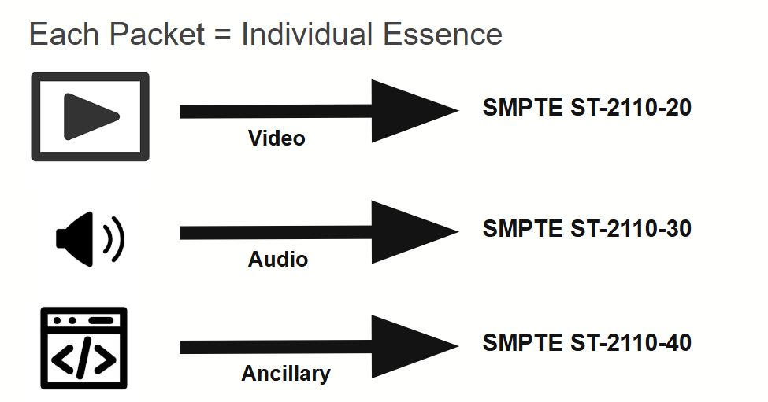
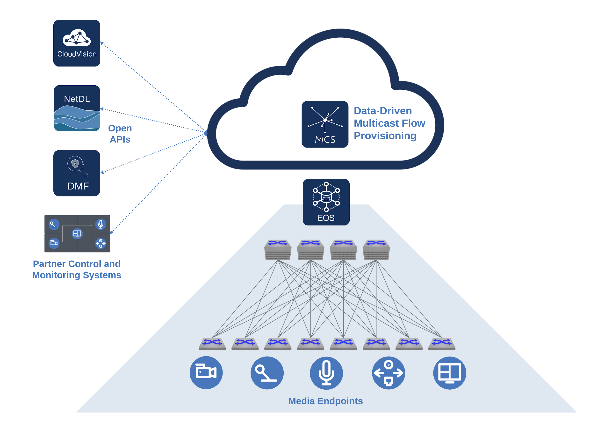
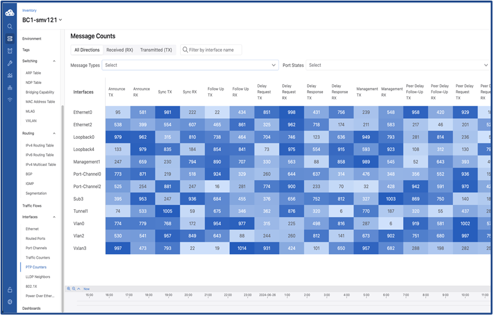

# The Arista Advantage in IP Broadcast

**✍️ Authors:** Ryan Morris, Media and Entertainment SME / Paul Mancuso, Systems Engineer

What typically comes to mind when you hear the phrase "media and entertainment"? Chances are, you picture major three-letter news stations, global sports franchises, or massive content delivery networks. However, the definition of a media and entertainment network has expanded far beyond these traditional boundaries. Today, a diverse range of verticals actively deploys robust IP broadcast capabilities. These capabilities support Fortune 500 enterprises, financial institutions, and houses of worship. Whether it involves facilitating remote education within the SLED sector, powering online training, or supporting critical video distribution in healthcare, high-quality media delivery is now a universal necessity.

Over the past decade, the distribution of video and audio content over IP networks has become commonplace, with major broadcasters paving the way by transitioning from traditional SDI to highly scalable SMPTE ST-2110 workflows. As organizations across various verticals embark on their own media distribution transformations, it is important to evaluate their infrastructure by asking: How is this IP migration being handled in the current environment, and how do we properly equip a network to deliver flawless video without dropping a single packet? Beyond core networking, what additional infrastructure components and features are required to ensure a streaming ecosystem operates with total cohesion?

Each element in the media stream has its own defined parameters and refers to each of them as an essence. The above image illustrates the individual essences that constitute a complete SMPTE ST-2110 signal. In this breakdown, each packet represents a unique essence, such as video, audio, or ancillary data. It is important to note that a single source can generate multiple streams for both the Audio and Ancillary signals.

To help assess a system's readiness, the following sections will explore the key pillars of Arista's Media and Entertainment portfolio—specifically Multicast Delivery, Precision Time Protocol (PTP) distribution, and Monitoring and Visibility—and explain why Arista remains the most reliable partner at the core of these critical industry deployments.

## Defining the Modern Media Network and Its Challenges

The transition to network media workflows is driven by the industry-wide adoption of SMPTE ST-2110. Unlike traditional SDI formats, SMPTE ST-2110 breaks uncompressed signals into individual, unique multicast streams for video, audio, and ancillary data (such as closed captioning). While this provides incredible format flexibility and workflow agility, it modifies the underlying workflow of routing broadcast systems in a media environment - and the scale of the network.

Routing a single camera feed might require adjusting ten different multicast groups simultaneously, with video flows reaching up to 10.6 Gbps. Because traditional routing protocols like IGMP and PIM are completely unaware of network topology or link bandwidth, they can easily cause oversubscription and packet drops when multiple heavy video flows land on the same link. In live broadcast environments—where a single frame drop during a major sporting event or a critical healthcare stream can cost millions of dollars or compromise critical operations—these legacy protocols are often inadequate.

## The Arista Value: Pillars of IP Media Success

The effectiveness of Arista's solutions in overcoming these obstacles is derived from a design philosophy established in the demanding realms of high-frequency trading and hyperscale cloud environments. In these sectors, unwavering reliability, balanced multicast distribution, and a necessity to completely prevent packet loss are fundamental necessities. Arista's structural superiority is founded on several core principles. Let's delve into them.

### Software Reliability and Advanced Multicast

Arista understands that the primary requirements of an ST-2110 network—massive multicast scaling and Precision Time Protocol (PTP)—mirror the intense demands of the financial sector. Arista's Extensible Operating System (EOS) provides state-streaming capabilities and isolated software processes, ensuring fault isolation and network resilience even under the load of tens of thousands of multicast groups.

### Media Control Service (MCS)

To solve the blind spots of IGMP and PIM, Arista developed the Media Control Service (MCS), a deterministic, network-aware orchestration middleware. MCS interacts directly with broadcast controllers to calculate bandwidth availability across the topology before routing. By programming the multicast forwarding information base (MFIB) in parallel across the fabric, MCS is not only significantly faster than traditional routing protocols while protecting links from oversubscription. Arista further eases the manageability of MCS through an easy-to-use API interface. Broadcast controllers integrate with this API interface to provision multicast flows required to support SMPTE ST2110, ST2022, AES67 and many other flow types.

Therefore, the key advantages of MCS include:

- Faster than traditional multicast routing protocols
- Bandwidth protection, from oversubscription and larger than expected flow provisioning
- Real-time notifications that broadcast controllers and other network monitoring tools can subscribe to - provides crucial information for system health and routing status of the media workflow

The following diagram illustrates Arista's software-defined architecture for modern IP media networks. On the left, third-party broadcast controllers and management platforms (like CloudVision) use Open APIs to communicate with Arista's Media Control Service (MCS). Acting as the intelligent orchestration brain, MCS performs "data-driven multicast flow provisioning" to calculate guaranteed bandwidth paths across the network. It then pushes these deterministic routing instructions through Arista's Extensible Operating System (EOS) directly into the underlying physical spine-leaf network fabric, seamlessly and reliably connecting the live media endpoints (cameras, audio feeds, and displays) shown at the bottom.

### Precision Time Protocol (PTP)

Flawless media synchronization requires a robust PTP stack. Arista network switches support both Boundary and Transparent Clocks, but typically Boundary Clocks are selected in order to lock to an upstream Grandmaster and reliably distribute timing to endpoints. This architecture reduces reliance on complex routing while providing granular, real-time visibility into clock accuracy, offsets, and network delays directly within CloudVision.

Another advantage of deploying a Boundary Clock is the inherent flexibility. Media systems typically have hundreds of endpoints, and at times, some will require different PTP messaging rates. A Boundary Clock provides the ability to granularly adjust the messaging rates on a per interface level - where some may run on the SMPTE 2059-2 profile, and others will run on the AES67 profile. There is a common profile that accommodates both of the profiles referenced above - AESR16-2016 - and this is often used to provide the most coverage while maintaining a consistent messaging rate.

As shown in the following diagram, Arista switches configured in Boundary Clock mode offer a distinct advantage: they operate independently of multicast or unicast routing. By locking onto an upstream Grandmaster or another Boundary Clock, they efficiently distribute precision timing across all PTP-enabled interfaces. Users can easily configure settings globally or for each interface, but they must ensure consistent messaging rates between connected interfaces, particularly the announce interval.

The image above demonstrates two aspects. Firstly, PTP message transaction sent and received between switches and endpoint and displays the messaging for a switch configured as a boundary clock. Secondly, the image details the advantage of using Boundary Clock mode, there is flexibility in configuring message rates on a per interface basis. This granular control is particularly advantageous when integrating diverse endpoints that demand unique announcement intervals compared to the rest of the fabric. By tailoring message rates on a per-interface basis, Arista provides the necessary flexibility to support these specific device requirements without compromising the timing integrity of the broader media environment.

A key advantage in how Arista operationalizes Boundary Clocks in media networks is the significant visibility of Arista EOS and CloudVision in tracking the performance and events. One such event is the triggering of an election for a new Grandmaster by the Best Master Clock Algorithm (BMCA). Here are example values from EOS CLI.

### PTP Message Counters Per Interface (CLI)

The Boundary Clock Per Interface Message Count event provides granular visibility into the volume of Precision Time Protocol (PTP) packets flowing across every individual switch port. Since PTP is a "chatty" protocol, an Arista switch acting as a Boundary Clock constantly exchanges messages (Announce, Sync, Follow-Up, Delay Request, and Delay Response) with attached cameras and monitors. This counter is crucial for monitoring system health: missing any of the messages described above can negatively affect a device's timing accuracy, with standard CLI providing insight data on a granular, per-interface detail of these values.

### Monitoring Accuracy of Boundary Clock compared to upstream GM

The following images display how CloudVision (CVP and CVaaS) tools leverage streamed telemetry from Arista network switches to capture data on the monitoring accuracy of the Boundary Clock compared to the upstream Grandmaster (GM). This capability allows network operators to gain deep insight into real-time network performance and behavior by providing comprehensive PTP topology views, event-driven alarms, and the continuous streaming of PTP counters. Additionally, CloudVision's time-series database enables engineers to perform historical analysis on past timing fluctuations or systemic changes that have occurred across the fabric.

The graphic image shows how CloudVision can identify PTP problems and make the PTP architecture easier to grasp. This initial CVP graphic displays the CloudVision PTP Boundary Clock topology and which Grandmaster each Boundary Clock is locking to.

The Unexpected PTP GMID (Grandmaster ID) graphic and event alert in Arista CloudVision provides a critical security and stability safeguard for your network's timing infrastructure. This feature alerts network operators immediately if a switch starts taking its time synchronization from an unapproved or "rogue" clock source.

While the GMID alert ensures your switches are listening to the right hardware clock, the Inconsistent PTP Domain ID event ensures your switches are participating in the correct logical timing network altogether. In PTP, a "Domain" is an isolated grouping of clocks. For instance, a device configured for Domain 127 will completely ignore timing packets from Domain 119. This CloudVision event alerts network operators immediately if a switch's active PTP Domain ID does not match the expected Domain ID set in your operational rules. It is much more useful to receive information in this manner as opposed to a general PTP error alert.

The CloudVision Boundary Clock PTP Counter graphic provides highly granular, real-time visibility into the actual volume of Precision Time Protocol (PTP) packets flowing across every individual switch port.

To understand why this is so valuable, you have to remember that PTP is an incredibly "chatty" protocol. Remember our earlier discussion. An Arista switch acting as a Boundary Clock (BC) is constantly exchanging a very specific rhythm of multicast messages—Announce, Sync, Follow-Up, Delay Request, and Delay Response—with the cameras and monitors attached to it.

In a healthy SMPTE ST 2110 environment, a device receiving timing should request the time at a very predictable mathematical rate (e.g., sending Delay Requests 8 times a second). A sudden burst of thousands of requests spraying the network can overwhelm a switch's control plane. Conversely, a sudden absence of timing messages would indicate a silent failure. CVP can offer granular detail of these issues on a per interface specificity.

Comprehensive PTP topology views, event-driven alarms, and the continuous streaming of PTP counters provide operators with an unprecedented window into real-time network performance and behavior. Furthermore, leveraging CloudVision's time-series database, engineers can perform historical analysis to gain granular insight into past timing fluctuations or systemic changes that have traversed the fabric.

### Ecosystem Partnerships and Visibility

Broadcasters often fear that migrating to IP will turn their infrastructure into a "black box." Arista mitigates this by partnering heavily with broadcast technology leaders like Evertz, EVS, Imagine Communications, Lawo, and Nevion for Broadcast Control applications and Providius and Skyline for Monitoring and Observability. By integrating deeply with these partners, Arista helps to reshape IP Media workflows to provide operators and engineers with data critical to understanding the minute by minute workflow changes.

## Dedicated Organizational Expertise

Technology alone does not guarantee a successful IP migration; the people behind the architecture are a critical business driver. Arista's dedicated Media and Entertainment Working Group brings decades of combined, practical industry experience, with experts who have previously worked deep within television stations and major system integration firms. This extensive real-world broadcast knowledge is further solidified by the team's specialized industry patents—including patented innovations surrounding Media Control Service flow routing and management. This proven authority makes Arista not just a hardware vendor, but a seasoned consulting partner capable of guiding enterprises through complex ST-2110 migrations.

The CloudVision platform extends its value beyond real-time monitoring and visibility to serve as the unified, multi-domain control and automation plane for the entire media environment. Just as network engineers leverage CloudVision for consistent configuration management and Day 2 operations within Data Center and Campus environments, the same operational model applies seamlessly to M&E infrastructure. This consistency is the core value proposition of CloudVision's multi-domain approach: providing a single pane of glass for automated deployments, change control, and continuous telemetry across all segments—from core broadcast networks to enterprise-wide video distribution. By consolidating management across domains (DC, Campus, WAN/Branch, and Cloud), Arista significantly reduces operational complexity, streamlines network security, and enables faster troubleshooting through a consistent, single-platform architecture.

## Assessing the Infrastructure Readiness

As media and entertainment workflows continue to expand into enterprise, education, and healthcare operations, it is imperative to evaluate the foundation of IP distribution. Based on the pillars outlined above, consider the following questions when reviewing the environment:

- Does the current network infrastructure actively prevent link oversubscription when routing massive uncompressed video flows?
- Do network and broadcast controllers share a unified, real-time view of network topology and bandwidth state?
- Is there a means for instant, actionable telemetry and tallies if a media flow fails or a PTP Grandmaster clock loses sync?

As a leading vendor of the industry's migration toward networked SMPTE ST-2110 workflows, Arista delivers the unwavering software reliability and advanced multicast capabilities required for modern media ecosystems. By leveraging the deterministic orchestration of Media Control Service (MCS) and a robust PTP stack utilizing Boundary Clock deployments, Arista ensures flawless synchronization and total infrastructure visibility. Arista is established as the premier partner for essential broadcast transitions through its extensive suite of tailored technologies and influential industry alliances. We are eager to support our channel partners as they undertake and execute new broadcast initiatives. For more information, please contact [media-ent@arista.com](mailto:media-ent@arista.com)

## Resources

- M&E Team Contact: [media-ent@arista.com](mailto:media-ent@arista.com)
- Arista M&E Solutions: <a href="https://www.arista.com/en/solutions/media-entertainment" target="_blank">Media and Entertainment Solutions Page</a>
