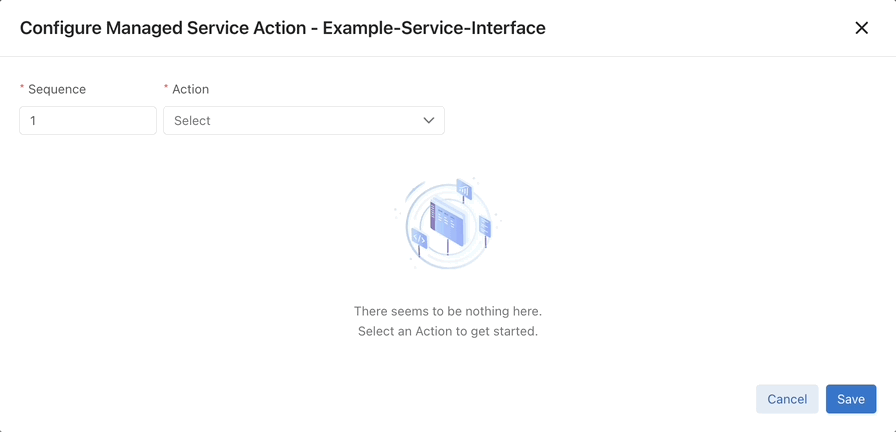
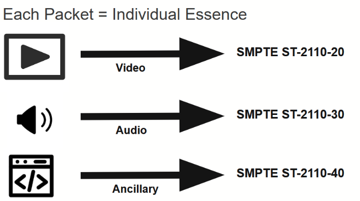
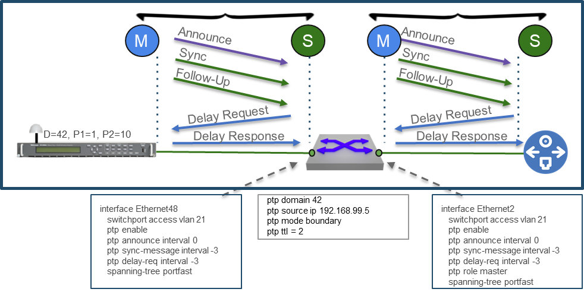
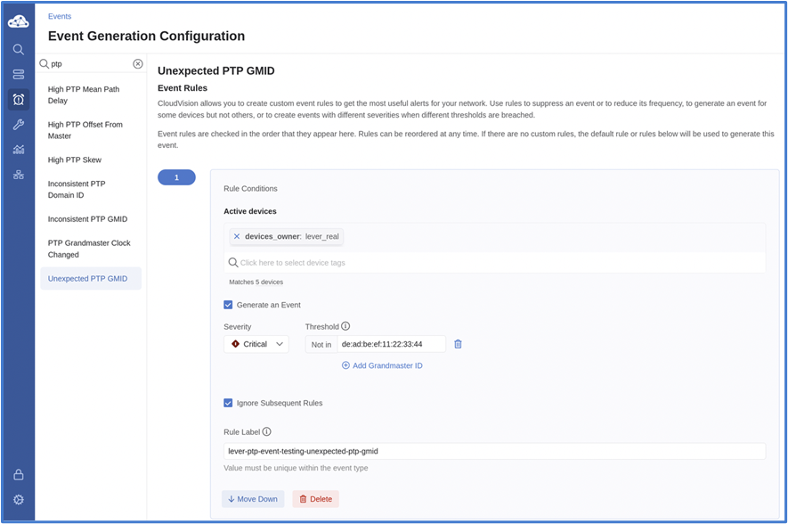
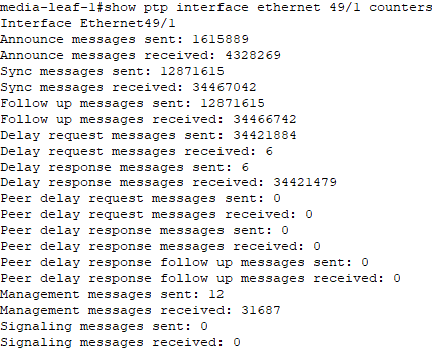
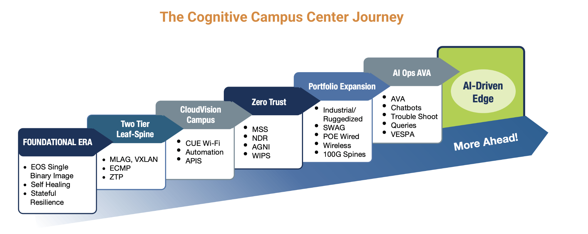

# Engineers' Exchange - Version 2026.2

  
  
Engineers sharing with engineers

*Published: June 2026 | Version 2026.2 | Q2 2026 Edition*

Welcome to **Engineers' Exchange Version 2026.2**! This quarterly edition brings you comprehensive technical updates - engineers sharing with engineers.

## 📰 In This Issue

- **Product Updates**: Deep technical dives into 4 cutting-edge technologies
- **Industry Spotlight**: Arista in the news and market trends
- **Upcoming Events**: Technical workshops and training sessions

---

## 🚀 Product Updates

This quarter, we're diving deep into four technologies that are transforming modern networks. Engineers sharing technical insights with engineers.

---

### 1️⃣ DANZ Monitoring Fabric: Wireshark Integration & the Combo Service Node

**✍️ Authors:** Brandon Mainock, Advisory Systems Engineer

*The DMF Controller Overview — a single pane showing Controller Health, Switch Health, Policy Health, Smart Node Health, top interfaces by traffic, and top policies*

**Overview**

The best way to appreciate a great tool is to have lived without it. DANZ Monitoring Fabric (DMF) has always been one of Arista's most powerful network observability platforms — but recent releases have made centralized packet capture workflows dramatically more efficient. This article covers two major additions: a full Wireshark instance embedded directly in the DMF Controller UI, and a new Combo Service Node that unifies advanced packet processing and packet recording in a single appliance. Together, these features eliminate steps, reduce dependencies on local machines, and make deep packet inspection more accessible than ever.

**Key Technical Highlights:**

- **Wireshark on DMF Controllers**: A full, unmodified Wireshark instance is now embedded in the DMF Controller UI — not watered down. Recorded pcaps can be viewed directly in-browser without exporting to a local machine, eliminating download delays and storage logistics.
- **Recorder Node Query Types**: The DMF UI supports three query types against recorder nodes — Window (earliest/latest packet received), Size (expected data volume), and Packet Data (pcap generation based on defined parameters).
- **The Combo Service Node**: A new service node variant combines advanced packet processing capabilities with a 32TB drive for packet recording — all in a single appliance. Replaces the need for separate recorder and service nodes in many deployments.
- **Modular, Pay-As-You-Grow Scaling**: Service nodes follow a linear capacity model (10Gbx4 → 25Gbx4 → 100Gbx4) and can be added to the DMF fabric incrementally as demand grows.

**Platform Specifications:**

**DMF Controllers — Appliance, VM, Public Cloud**
- **Role**: Central management plane for the entire DMF fabric — switches, service nodes, and recorder nodes are all configured and managed from the Controller UI
- **New Capability**: Full Wireshark instance now available directly in the Controller UI for in-browser pcap analysis
- **Deployment Options**: Physical appliance, virtual machine, or public cloud instance
- **Use Cases**: Centralized network observability, packet capture management, recorder node querying

**Service Node With Recording Action (Combo Node)**
- **Recording Capacity**: 32TB onboard storage for packet recording
- **Processing Capabilities**: Advanced packet processing (AppID, Deduplication, IPFIX record generation) combined with recording on a single device
- **Interface Options**: 10Gbx4, 25Gbx4, 100Gbx4 — linear scaling model
- **Deployment Model**: Modular, pay-as-you-grow — add nodes to the fabric as capacity needs increase
- **Use Cases**: Smaller deployments requiring both recording and processing without separate appliances; cost-effective unified observability

**Service Node Terminology:**
- **Actions**: Services configurable on an interface — examples include AppID, Deduplication, and IPFIX record generation
- **Service Interface**: Ports assigned one or more actions; multiple actions can be stacked on a single interface at the cost of some bandwidth

*The DMF UI for configuring a Managed Service Action on a service interface — select the action type (AppID, Deduplication, IPFIX, etc.) to apply to a given port*

---

**Technical Benefits:**

**1. Wireshark on DMF Controllers**

- **Not watered down**: The Wireshark instance integrated into the DMF UI is the full product — profiles, custom layouts, and conversation analysis windows are all intact. Engineers who know Wireshark will find everything they expect.
- **No more local device necessity**: Previously, viewing a pcap required exporting it from the recorder node to a local machine with Wireshark installed. For large pcaps or remote connections, this meant long download times and a dependency on having enough local storage. With Wireshark now embedded in the DMF Controller UI, pcaps can be opened and analyzed directly — no export required. This reduces data usage over remote connections, eliminates storage logistics, and consolidates the entire workflow in one place.

**2. Service Node with Recording Action (Combo Node)**

- **Huge win for smaller deployments**: One of DMF's core value propositions is that it scales easily and cost-effectively. The pay-as-you-grow model is truly... *[⚠️ INCOMPLETE IN SOURCE DOCUMENT — author input needed to complete this section]*
- **Workflow still works**: *[⚠️ INCOMPLETE IN SOURCE DOCUMENT — author input needed to complete this section]*

---

**Deployment Use Cases:**

**Distributed NOC / Remote Site Troubleshooting**
- **Challenge**: Remote network engineers need to analyze packet captures from sites they cannot physically access, but exporting large pcaps over WAN links is slow and consumes bandwidth
- **Solution**: Wireshark embedded in the DMF Controller UI allows engineers to open and analyze pcaps directly in the browser — no download required
- **Benefits**: Faster time-to-resolution, reduced WAN bandwidth consumption, no dependency on local machine storage capacity

**Mid-Market and Branch Deployments**
- **Challenge**: Smaller deployments need both advanced packet processing (deduplication, AppID, IPFIX) and packet recording, but deploying separate service nodes and recorder nodes adds cost and complexity
- **Solution**: The Combo Service Node delivers both capabilities in a single appliance with 32TB of recording storage
- **Benefits**: Reduced hardware footprint, simplified cabling and management, cost-effective entry into full-featured DMF functionality

**Scalable Security Operations**
- **Challenge**: Security teams need to capture and retain packet data at scale while also running real-time analytics — these functions previously required separate hardware
- **Solution**: Combo nodes handle both recording and processing in one unit; additional nodes can be added to the DMF fabric as traffic volumes grow
- **Benefits**: Linear, non-disruptive capacity expansion; unified management of recording and processing through the DMF Controller

---

**Partner Opportunities:**

- **Network Observability Refresh**: Position DMF upgrades to customers who rely on packet capture for security or troubleshooting — the Wireshark integration is a compelling, easy-to-demo improvement over legacy workflows
- **Consolidated Appliance Sales**: The Combo Node is a strong upsell for customers running separate service and recorder nodes, or a right-sized entry point for mid-market opportunities
- **Remote/Multi-Site Customers**: Customers with distributed teams or WAN-connected sites have an immediate pain point that the Wireshark-in-UI feature directly solves — use it to open the DMF conversation
- **Security-Focused Accounts**: Customers with SOC or incident response functions are natural targets for full DMF deployments; the Combo Node reduces the barrier to entry

**Resources:**

- DMF Product Page: <a href="https://www.arista.com/en/products/danz-monitoring-fabric" target="_blank">DANZ Monitoring Fabric</a>
- DMF Documentation: <a href="https://www.arista.com/en/support/toi/danz" target="_blank">DMF Technical Documentation</a>

---

### 2️⃣ The Arista Advantage in IP Broadcast

**✍️ Authors:** Ryan Morris, Media and Entertainment SME / Paul Mancuso, Systems Engineer

*Each packet represents a unique essence — video, audio, or ancillary data — within a complete SMPTE ST-2110 signal*

**Overview**

The definition of a media and entertainment network has expanded well beyond major broadcasters. Today, Fortune 500 enterprises, financial institutions, healthcare organizations, houses of worship, and SLED institutions all rely on robust IP broadcast capabilities for video distribution, remote education, online training, and critical media workflows. Over the past decade, the industry-wide shift from traditional SDI to SMPTE ST-2110 has made high-quality IP media delivery a universal infrastructure requirement — and the network at its core must be built to handle it flawlessly. This article explores the three core pillars of Arista's Media and Entertainment portfolio — Multicast Delivery, Precision Time Protocol (PTP), and Monitoring and Visibility — and explains why Arista is the most reliable partner for these critical deployments.

**Key Technical Highlights:**

- **Media Control Service (MCS)**: A deterministic, network-aware orchestration middleware that calculates bandwidth availability across the topology before routing — eliminating the blind spots of traditional IGMP and PIM protocols and preventing link oversubscription for uncompressed video flows
- **Precision Time Protocol (PTP) — Boundary Clock Architecture**: Arista switches configured as Boundary Clocks lock to an upstream Grandmaster and distribute precision timing independently of multicast/unicast routing, with per-interface message rate configuration supporting SMPTE 2059-2, AES67, and AESR16-2016 profiles simultaneously
- **CloudVision Telemetry and Visibility**: Real-time PTP topology views, event-driven alarms (rogue Grandmaster detection, domain ID mismatches), per-interface PTP counter streaming, and historical time-series analysis — all in a single pane of glass
- **Ecosystem Partnerships**: Deep integrations with broadcast industry leaders including Evertz, EVS, Imagine Communications, Lawo, Nevion (broadcast control) and Providius, Skyline (monitoring and observability) through open APIs and the MCS interface

**Platform Specifications:**

**Arista EOS with Media Control Service (MCS)**
- **Role**: Software-defined multicast orchestration engine for SMPTE ST-2110, ST-2022, AES67, and related flow types
- **Integration**: Open API interface for direct integration with third-party broadcast controllers; programs the multicast forwarding information base (MFIB) in parallel across the fabric
- **Key Capabilities**: Bandwidth-aware flow provisioning, oversubscription prevention, real-time notifications for broadcast controllers and monitoring tools
- **Reliability**: State-streaming and isolated software processes in EOS ensure fault isolation even under tens of thousands of concurrent multicast groups
- **Use Cases**: Live broadcast routing, large-scale uncompressed video distribution, multi-source media workflows

*Arista's software-defined architecture for IP media: CloudVision, NetDL, DMF, and partner control systems connect via Open APIs to MCS, which performs data-driven multicast flow provisioning through EOS into the spine-leaf fabric and out to media endpoints*

**CloudVision (CVP and CVaaS)**
- **Role**: Unified multi-domain management, automation, and observability platform spanning M&E, Data Center, Campus, and WAN infrastructure
- **PTP Visibility**: Real-time Boundary Clock topology maps, per-interface PTP message counters, Grandmaster ID (GMID) change alerts, PTP Domain ID inconsistency detection
- **Historical Analysis**: Time-series database for retrospective analysis of timing fluctuations and systemic changes across the fabric
- **Operational Model**: Consistent management plane across all domains — same workflows used for DC and Campus apply directly to M&E infrastructure
- **Use Cases**: Day 2 operations, change control, continuous telemetry, multi-domain troubleshooting

---

**Technical Benefits:**

**1. Advanced Multicast with Media Control Service (MCS)**

- **Eliminates IGMP/PIM blind spots**: Traditional multicast routing protocols have no awareness of network topology or available bandwidth. A single camera feed in SMPTE ST-2110 can generate video flows up to 10.6 Gbps, and routing multiple heavy flows without bandwidth awareness causes oversubscription and packet drops — unacceptable in live broadcast
- **Deterministic flow provisioning**: MCS calculates guaranteed bandwidth paths before committing a route, then programs the MFIB in parallel across the fabric. This makes MCS significantly faster than traditional protocols while ensuring no link is ever oversubscribed
- **Broadcast controller integration**: MCS exposes an easy-to-use API that broadcast controllers integrate with directly to provision multicast flows — supporting SMPTE ST-2110, ST-2022, AES67, and more
- **Real-time notifications**: Broadcast controllers and monitoring tools can subscribe to MCS notifications for instant, actionable updates on routing status and system health

**2. Precision Time Protocol (PTP) — Boundary Clock Deployment**

- **Independent, reliable timing distribution**: Arista switches in Boundary Clock mode lock to an upstream Grandmaster and distribute precision timing to all PTP-enabled interfaces without relying on multicast or unicast routing — providing resilience against routing changes
- **Per-interface message rate flexibility**: Media environments often have hundreds of endpoints with different timing requirements. Boundary Clocks allow administrators to configure PTP messaging rates on a per-interface basis, supporting SMPTE 2059-2, AES67, and the common AESR16-2016 profile simultaneously on the same switch

*PTP Boundary Clock mode: the switch locks to an upstream Grandmaster and independently distributes Announce, Sync, Follow-Up, Delay Request, and Delay Response messages to each endpoint — with per-interface messaging rates configurable directly in EOS*

- **Rogue Grandmaster detection**: CloudVision raises an immediate alert if any switch begins taking timing from an unapproved clock source (unexpected GMID event), preventing timing instability before it impacts media streams

*CloudVision Event Generation Configuration for an Unexpected PTP GMID — triggers a Critical alert if a switch locks to any Grandmaster not on the approved list, catching rogue clock sources before they destabilize the media environment*

- **Domain ID integrity monitoring**: CloudVision's Inconsistent PTP Domain ID event alerts operators the moment a switch joins the wrong logical timing domain — far more actionable than a generic PTP error

*CloudVision Event Generation Configuration for an Inconsistent PTP Domain ID — alerts immediately if a switch's active domain does not match the expected domain (e.g., Domain 127), ensuring switches stay in the correct logical timing group*

- **Granular counter visibility**: Per-interface PTP message counters (Announce, Sync, Follow-Up, Delay Request, Delay Response) in both EOS CLI and CloudVision make it straightforward to identify silent failures or unexpected message bursts that could overwhelm the switch control plane

*EOS `show ptp monitor` output showing Offset from Master, Mean Path Delay, and Skew per interface — key values for validating Boundary Clock accuracy against the upstream Grandmaster*

*EOS `show ptp interface ethernet 49/1 counters` — granular per-interface breakdown of every PTP message type sent and received, essential for identifying silent failures or asymmetric message flows*

**3. Monitoring, Visibility, and Ecosystem Partnerships**

- **Not a black box**: A common concern when migrating from SDI to IP is losing the intuitive signal routing visibility of traditional broadcast infrastructure. Arista addresses this directly through deep integrations with industry-leading monitoring platforms (Providius, Skyline) and broadcast controllers (Evertz, EVS, Imagine Communications, Lawo, Nevion)
- **CloudVision as the unified control plane**: The same CloudVision workflows used for Data Center and Campus management apply directly to M&E — consistent configuration management, change control, and real-time telemetry across all domains from a single platform

*CloudVision PTP topology view showing which Boundary Clock is locking to which Grandmaster — multiple GM clock sources are color-coded, making it immediately clear when a switch is locking to an unexpected or secondary clock*

*CloudVision Boundary Clock PTP counter dashboard for BC1-smv121 — real-time and historical per-interface counts for every PTP message type across all switch ports, enabling instant detection of message bursts or silent failures*

- **Dedicated M&E expertise**: Arista's Media and Entertainment Working Group brings decades of practical broadcast industry experience, including engineers with backgrounds inside television stations and major system integration firms, plus patented innovations in MCS flow routing and management

---

**Deployment Use Cases:**

**Live Broadcast and Sports Production**
- **Challenge**: A single dropped frame during a major sporting event or live news broadcast can cost millions of dollars. Legacy multicast protocols cannot guarantee bandwidth for multiple simultaneous 10.6 Gbps video flows
- **Solution**: MCS calculates bandwidth availability across the spine-leaf fabric before routing any flow, preventing oversubscription. EOS state-streaming and fault isolation ensure the network remains stable under the load of tens of thousands of multicast groups
- **Benefits**: Zero frame drops, deterministic routing, real-time alerts on any flow or timing anomaly

**Enterprise Video Distribution**
- **Challenge**: Large enterprises require high-quality video distribution for executive communications, all-hands broadcasts, and training — but traditional AV infrastructure doesn't scale to modern IP networks
- **Solution**: Arista's ST-2110 and AES67-capable infrastructure, managed through CloudVision, extends broadcast-grade reliability to enterprise environments without requiring specialized broadcast engineers for day-to-day operations
- **Benefits**: Unified management alongside existing campus/DC infrastructure, consistent operational model, broadcast-grade reliability at enterprise scale

**Healthcare Video and Critical Media**
- **Challenge**: Healthcare environments depend on flawless video streams for surgical guidance, remote diagnostics, and patient monitoring — any interruption has direct clinical consequences
- **Solution**: Boundary Clock PTP distribution ensures surgical-precision timing synchronization; MCS guarantees bandwidth for critical video flows; CloudVision provides immediate alerting on any timing or routing anomaly
- **Benefits**: Continuous stream integrity, instant fault detection, simplified compliance with the unified management model

**Education and SLED Remote Learning**
- **Challenge**: Schools, universities, and government institutions increasingly rely on IP video for remote instruction and distance learning, but lack dedicated broadcast engineering staff
- **Solution**: CloudVision's simplified management plane and MCS's automated flow provisioning reduce the operational burden — broadcast-grade infrastructure that generalist IT teams can manage
- **Benefits**: Reduced operational complexity, broadcast-quality remote learning delivery, scalable as institutions grow

**Financial Services Video**
- **Challenge**: Financial institutions use video for trading floor communications, executive broadcasts, and regulatory recordings — all requiring low-latency, lossless delivery
- **Solution**: Arista's architecture was purpose-built for the demands of high-frequency trading environments, where the same requirements for lossless delivery and deterministic latency apply directly to media workflows
- **Benefits**: Proven reliability in the most demanding environments, lossless video delivery, consistent latency

---

**Partner Opportunities:**

- **ST-2110 Migration Projects**: Guide customers through the transition from SDI to IP — Arista's dedicated M&E team and patented MCS technology make this a differentiated, consultative sale
- **Enterprise AV / Video Distribution**: Any enterprise with internal broadcast, executive communications, or large-scale video distribution needs is a potential M&E opportunity — the market is far broader than traditional broadcasters
- **Healthcare Infrastructure**: Position Arista M&E solutions in healthcare accounts where video is clinical infrastructure, not just communications
- **SLED and Education**: Remote and hybrid learning initiatives create ongoing demand for broadcast-grade IP video infrastructure in schools, universities, and government agencies
- **Monitoring and Visibility Upsell**: Engage broadcast control and monitoring ISV partners (Evertz, EVS, Providius, Skyline) to expand deal scope beyond switching into full-stack IP media solutions

**Resources:**

- M&E Team Contact: [media-ent@arista.com](mailto:media-ent@arista.com)
- Arista M&E Solutions: <a href="https://www.arista.com/en/solutions/media-entertainment" target="_blank">Media and Entertainment Solutions Page</a>
- MCS Documentation: <a href="https://www.arista.com/en/support/toi/media-control-service" target="_blank">Media Control Service Technical Overview</a>

---

### 3️⃣ The Next Evolution of Network Operations: CloudVision's Unified Hierarchy & Studio Orchestration

**✍️ Authors:** Drew Langin, Systems Engineer

*CloudVision's Multi-Domain Network Hierarchy — configuration is inherited top-down across Global, Location, and Switch tiers (Company XYZ → Site 1 / Site 2 → spines and leafs). This tag-based model is what the Static Configuration Studio uses in place of legacy configlet trees.*

**Overview**

Modern network operations are increasingly defined by multi-domain environments that span the campus, data center, and wide-area network (WAN). Managing these distinct environments has historically required segregated toolsets, varying automation methodologies, and highly specialized CLI skills. This article examines the recent structural updates to Arista CloudVision, focusing on the convergence of Day 0 through Day 2 operations into a unified network hierarchy. We look at the migration from legacy container-based provisioning to template-free abstraction engines (Studios), the operationalization of graphical front-panel diagnostics for campus environments, and the implementation of automated, compliance-safe workspace workflows.

**Key Technical Highlights:**

- **Multi-Domain Network Hierarchy**: A single EOS software baseline projects campus, data center, and WAN into one dashboard, merging telemetry and active provisioning into a unified top-down view — from a global map down to the individual transceiver port.
- **Studios Orchestration**: The decade-old legacy Network Provisioning app (static configlet-tree inheritance) is being phased out in favor of Studios — a template-free abstraction layer built directly on Arista Validated Designs (AVD), with a one-click Guided Migration Tool to convert existing configlet trees into tags.
- **Campus Guided Onboarding**: Zero-Touch Provisioning (ZTP) abstracted into point-and-click workflows, with real-time LLDP topology validation, dynamic host-naming, and automated subnet/IPAM allocation.
- **Front-Panel Diagnostics & Virtual Stacking**: Physical stacks, MLAG pairs, and Switch Aggregation Groups (SWAG) aggregate into a single Virtual Stack View, with standardized Port Profiles plus in-UI TDR cable tests and interface/PoE cycling.
- **Workspaces & Compliance**: Every change is gated by transactional dry-run validation, side-by-side compliance diffs, RBAC-driven Change Control, and full audit logging — surfaced through the persistent Workspace Island.
- **Telemetry & Extensibility**: The Request Recorder turns UI actions into production-ready Python, and time-block event widgets bucket streaming anomalies for instant drill-down.

**Architectural Deep Dive:**

**1. Architectural Convergence: Multi-Domain Network Hierarchy**

A primary challenge in enterprise networking is bridging the operational gap between highly structured data centers and heterogeneous, dynamic campus topologies. CloudVision addresses this by leveraging a single Extensible Operating System (EOS) software baseline across all platforms, projecting a Multi-Domain Network Hierarchy View within a single dashboard. Unlike legacy platforms that separate real-time monitoring from state configuration, this architecture merges telemetry and active provisioning into one unified view — enabling a top-down approach that lets engineers drill down from a global multi-domain map into regional pods, specific buildings, individual switch stacks, and down to the physical transceiver port level.

**2. Day 0/1 Provisioning: Guided Onboarding & Studios Abstraction**

Manual configuration of campus access layers introduces high human-error rates and prolonged deployment times. CloudVision mitigates this through Campus Guided Onboarding Workflows that abstract ZTP into automated point-and-click operations.

- **Pre-Provisioning Topology Validation**: As unconfigured hardware boots in ZTP mode, the guided workflow auto-discovers neighbor links via LLDP and maps the prospective topology *before* applying configuration scripts — eliminating the "flying blind" problem of cabled-but-unconfigured switches.
- **Algorithmic Parameter Generation**: Operators define an organizational naming-convention prefix and the orchestration layer dynamically sequences and generates hostnames across large device batches. In-band management subnets and VLAN variables are declared globally at the campus or pod tier, and the system automatically carves out the next available IP from that block — eliminating manual IPAM tracking errors.
- **The Evolution to Studios**: The legacy Network Provisioning app (static hierarchical configlet inheritance) is being structurally phased out in favor of Studios.

> Legacy Network Provisioning (Configlet Trees) → Migrated via Tool → Static Configuration Studio (Tag-Based)

Studios operate as an abstraction layer directly on top of Arista Validated Designs (AVD). Rather than forcing engineers to write rigid CLI fragments, they compile declarative inputs into validated, rendered configurations. For environments with deeply entrenched configlet architectures, the one-click Guided Migration Tool ingests the entire legacy container tree, preserves existing image bundles and configlets, maps them into tags, and rebuilds them inside the Static Configuration Studio and Software Management Studio natively.

**3. Day 2 Operations: Abstracted UI Workflows & Hardware Diagnostics**

Campus operators and field engineers are frequently task-focused — toggling ports, reassigning VLANs, troubleshooting physical-layer issues — rather than dedicated CLI specialists. To optimize these workflows, CloudVision introduces graphical front-panel and virtual-stack orchestration engines.

*The graphical Virtual Stack View aggregates a five-member 720XP SWAG stack into a single front-panel object — per-port status, interface profiles, and live telemetry (EOS version, events, uplink bandwidth) all in one pane.*

- **Port Profiles & Virtual Stacking**: Rather than evaluating switches as isolated nodes, CloudVision aggregates multi-switch clusters — physical stacks, MLAG pairs, or SWAG pods — into a single Virtual Stack View. Interfaces are managed via standardized Port Profiles defined within Studios, where a profile wraps a complete configuration state (native VLAN, trunking mode, descriptions, PoE priorities) into a single object. Applying it across many physical ports generates one background configuration delta, abstracting the underlying syntax entirely.
- **Automated Hardware Diagnostics**: To accelerate Mean Time to Resolution (MTTR), low-level EOS diagnostics are exposed directly in the front-panel UI. **Time-Domain Reflectometry (TDR) cable tests** query the underlying EOS layer and render a visual breakdown of each twisted pair with an exact distance-to-fault metric in meters (note: this disrupts link-state traffic). **Interface Cycle Testing** exposes two software execution loops — an Administrative Cycle (`shutdown`/`no shutdown`) to force link renegotiation, and a PoE Cycle that drops and restores inline power to remotely reboot downstream endpoints without resetting the switch.

**4. Continuous Integration & Compliance: Workspaces and Telemetry**

Every structural change inside CloudVision is gated by a robust transactional safety mechanism designed to ensure compliance and audit trails.

*The Workspace Island — a persistent staging modal for drafting, validating (dry-run), and submitting workspaces. Once submitted, changes flow to Change Control for approval and execution.*

- **The Workspace Island**: A persistent modal staging environment that eliminates the page navigation historically required when reviewing bulk changes. Workspaces act as isolated sandboxes where configuration deltas are verified via dry-run compilations, with clear side-by-side diff views showing exactly how running configs and software images will shift. During software verification, the platform references live upgrade streams to inject **Intelligent EOS Lifecycle Banners** — if an engineer stages an outdated version, the system flags the latest validated maintenance release to mitigate known bug exposure.
- **Differentiated Change Control**: An **Asynchronous Manual Review** path handles standard modifications (e.g., Port Profile reassignments) — the operator submits the workspace, triggering a formal Change Control window bound by RBAC and scheduling constraints. A **Synchronous Automated Review** path handles quick diagnostic overrides (TDR tests, PoE resets) — CloudVision spins up an ephemeral workspace behind the scenes, executes a targeted Change Control, log-records the transaction, and tears the workspace down automatically once complete.
- **Telemetry & Extensibility**: The **Request Recorder** transparently intercepts and logs the exact REST API calls and JSON payloads the UI sends to the server, letting engineers reverse-engineer UI interactions into production-ready Python without wading through API docs. **Time-Block & Threshold Event Widgets** aggregate streaming anomalies into graphical time-block matrices — a spike in errors flips a block to a warning state, letting engineers click straight into the exact time-slice for streaming metrics.

**The Bottom Line**

These updates show a deliberate evolution toward an abstract, highly automated network operating model. By combining campus, WAN, and data center domains into a cohesive hierarchy and shifting provisioning logic entirely to Studios, CloudVision eliminates legacy operational barriers. Stripping away traditional CLI overhead through front-panel diagnostics, Port Profiles, and automated workspace validation minimizes human error — enabling consistent, verified change management across the entire network footprint.

**Partner Opportunities:**

- **Campus Modernization & Migration**: Customers with large, entrenched legacy configlet trees are ideal candidates for the one-click Studios Guided Migration — a low-risk, high-value modernization conversation.
- **Lean IT / Operational Simplification**: Front-panel diagnostics (TDR, interface/PoE cycling) and Port Profiles reduce CLI dependency, making CloudVision a strong fit for accounts without deep network-engineering benches.
- **Compliance-Driven Accounts**: Workspaces, dry-run validation, RBAC Change Control, and full audit logging map directly to regulated industries' change-management requirements.
- **Automation & DevOps Upsell**: The Request Recorder is a natural hook for automation services — turning UI workflows into Python opens the door to broader NetDevOps engagements.

**Resources:**

- Source: CloudVision Chats Ep. 5 — "Christmas Special: A Lookback on 2025 and Our Favorite Features"
- CloudVision Product Page: <a href="https://www.arista.com/en/products/eos-cloudvision" target="_blank">Arista CloudVision</a>

---

### 4️⃣ The Many Facets of AI Fabrics

**✍️ Recognition:** Re-imagined for partners from the original authors' blog 

*As we enter the generative AI era, the network has become the elastic backplane of AI infrastructure — the fabric that defines the efficiency of AI itself*

**Overview**

As computational resources scale to meet the demands of large generative AI models, networking plays a crucial role in improving the utilization of precious cycles from accelerator processing units (XPUs). The network has become the governor of AI performance — every stalled packet, every microsecond of congestion, translates directly to loss of revenue. Conversely, well-optimized networks unlock latent AI performance across distributed XPU systems. In a world of trillion-parameter models and real-time inference, the efficiency of the network defines the efficiency of AI itself. This article reviews the three key network strategies used to connect and scale AI accelerators — **Scale-Up**, **Scale-Out**, and **Scale-Across** — and how Arista unifies them into a single AI Fabric.

**Key Technical Highlights:**

- **Scale-Up (Intra-Rack)**: Non-blocking, low-latency interconnect of XPUs within a single rack for shared memory coherency — enabled by liquid cooling for density and co-packaged copper/optics (CPC/CPO), with Ethernet Scale-Up Networking (ESUN) on a 200G SerDes foundation as an open alternative to proprietary interconnects.
- **Scale-Out (Inter-Rack)**: Horizontal scaling across racks in a flat two-tier leaf-spine fabric; massive radix maximizes reachable XPUs while preserving bisection bandwidth, with topology-aware Cluster Load Balancing (CLB) replacing static routing.
- **Scale-Across (Inter-Site)**: Interconnects physically separated AI clusters over distance via integrated internet, storage, WAN, and optical layers — using hierarchical deep buffers and SRv6 micro-segment (uSID) routing to absorb transient congestion and micro-bursts.
- **AI Etherlink™ Platforms**: Optimize the Multipath Reliable Connection (MRC) protocol via hardware-accelerated packet trimming and intelligent buffering to minimize tail latency.
- **Multi-Planar Orchestration**: Isolates traffic across independent fabric planes for deterministic performance and increased resiliency.
- **7800 AI Spine**: A high-radix spine layer for metro-mesh topologies, offloading inter-cluster traffic and leveraging SRv6 for stateless, end-to-end routing across geographically dispersed sites.

*Networking for the AI Center: a Front End Leaf Spine connects CPUs, storage, and users, while the Back End AI Fabrics scale up (intra-rack, ~1k XPUs), out (inter-rack, ~100k XPUs), and across (inter-site, >1M XPUs)*

**The Three AI Fabric Strategies:**

**1. Scale-Up — High-Speed XPU Interconnect, Intra-Rack**

Vertical XPU scaling interconnects multiple compute nodes within a single rack using non-blocking, low-latency switches to achieve shared memory coherency. Workloads distributed across multiple XPUs in the same rack can access unified memory as a single giant pool, coordinating via non-blocking all-to-all communications. The advantage is simplicity — localized computation and high computational density. Modern designs improve XPU density through liquid cooling (reducing heat and power) complemented by low-power, high-bandwidth interconnects like co-packaged copper/optics. This close-knit integration means a single interconnect link failure or memory error can stall the whole node, requiring appropriate collective controls within the scale-up fabric.

**2. Scale-Out — High-Speed XPU Interconnect, Inter-Rack**

Scale-out (horizontal) scaling adds more machines, moving workloads across multiple servers or nodes and connecting storage, general-purpose CPUs, and WAN. These dual-mode systems traverse both east-west and north-south patterns, making them ideal for distributed training and inference parallelized across nodes. Scale-out efficiency is driven by network topology economics: by leveraging massive radix, operators maximize the number of XPUs reachable in a flat two-tier leaf-spine network — maintaining bisection bandwidth without the penalty of an extra tier of transceivers and fiber in power-conscious AI centers.

**3. Scale-Across — AI Performance Across Distance and Locations**

Scale-across expands across multiple datacenters by interconnecting physically separated AI clusters or pods over large distances, letting training jobs span a massive number of XPUs and pooling geographically distributed resources for frontier models. This requires robust infrastructure integrating internet, storage, WAN, and optical layers through complex routing and hierarchical deep buffers to absorb the transient congestion and micro-bursts inherent in distributed AI workloads. Advanced traffic engineering, robust encryption, and sophisticated routing keep AI compute clusters resilient and secure across multiple tenants.

**The Next Frontier — Unified AI Fabrics**

With the relentless growth of AI workloads, the industry is moving beyond isolated, single-purpose networks toward unified AI fabrics that transform classic leaf-spine architectures into intelligent, multi-fabric systems synchronizing scale-up, scale-out, and scale-across. This paradigm converges the deterministic, RDMA-driven performance required for scale-out clusters with the metro-scale traffic steering needed for distributed deployments. By harmonizing hardware and software networking, customers get the economic simplicity of a two-tier design while scaling from thousands to millions of AI accelerators. The optimization of the MRC protocol — combined with SRv6 uSID support in EOS® — minimizes tail latency and enables fine-grained, source-routed steering, while multi-planar orchestration isolates traffic across independent fabric planes.

**One Consistent, Resilient Architecture**

More than a decade ago, Arista pioneered the Universal leaf-spine (CLOS) architecture to replace rigid, oversubscribed three-tier data center networks. Traffic patterns have since shifted from strictly east-west to massive, synchronized all-to-all and all-reduce bursts for AI training and inference, while bandwidth demands explode from 112G SerDes to 224G and soon 448G per lane. Modern AI centers must simultaneously cope with the synchronous elephant flows of massive training and the low-latency, concurrent swarms of real-time inference — conditions where static topologies suffer hotspot jitter that slows Job Completion Time (JCT) or increases Time to First Token (TTFT). Adaptive AI fabrics across L1/L2/L3, implemented as multi-planar designs, overcome these slowdowns and deliver one consistent, resilient architecture for the age of agentic AI.

**Partner Opportunities:**

- **AI/ML Infrastructure Buildouts**: Position the Etherlink portfolio and 7800 AI Spine for customers standing up GPU/XPU clusters — the Scale-Up/Out/Across framework is a clear, consultative way to map customer scale to architecture.
- **Open Ethernet vs. Proprietary Fabrics**: ESUN and standards-based Ethernet are a strong differentiator for accounts wary of proprietary scale-up interconnects.
- **Multi-Site / Metro AI**: Scale-Across with SRv6 uSID addresses customers distributing training across datacenters — a high-value WAN/optical + datacenter conversation.
- **Performance Optimization**: Lead with the business case — reduced JCT and TTFT directly translate to better XPU utilization and ROI on expensive accelerators.

**Resources:**

- Source: <a href="https://blogs.arista.com/blog/the-many-facets-of-ai-fabrics" target="_blank">"The Many Facets of AI Fabrics" — Arista Blog</a> (Jayshree Ullal and Hardev Singh, May 2026)
- Arista AI Networking Solutions: <a href="https://www.arista.com/en/solutions/ai-networking" target="_blank">arista.com/en/solutions/ai-networking</a>

---

## 📊 Industry Spotlight

### Arista Networks Positioned as a Leader in the 2026 Gartner® Magic Quadrant™ for Enterprise Wired and Wireless LAN

*Source: Gartner® Magic Quadrant™ for Enterprise Wired and Wireless LAN, as of April 2026 — Arista Networks positioned in the Leaders quadrant*

**Overview**

From the beginning our vision for the "Cognitive Campus" has been a unified architecture built on the rock-solid foundation of a single Extensible Operating System (EOS®) and real-time state streaming. Just as we revolutionized cloud and data centers, our customers have embraced this modern approach to campus networking.

Our ongoing commitment to innovation and customer success has led to a significant milestone in 2026: **Arista Networks has been recognized as a Leader in the 2026 Gartner Magic Quadrant for Enterprise Wired and Wireless LAN.**

---

**How We Got Here**

*The Cognitive Campus journey — from a single EOS binary and two-tier leaf-spine foundation to a zero-trust, AIOps-driven, AI-driven edge*

**Phase 1 — 2018–2021: Foundation Blueprint**

Arista replaced complex three-tier designs with a two-tier "Leaf Spline Edge Architecture." The 2018 Mojo Networks acquisition added controllerless Cognitive Wi-Fi with a distributed edge control plane, enabling cloud-scale AP management and seamless integration into the EOS Campus fabric.

By extending a single EOS binary from core to edge and utilizing CloudVision®, Arista unified management. Applying Arista Validated Designs (AVD) and Smart System Upgrades (SSU) minimized operational silos and maintenance overhead while ensuring architectural consistency across switch types.

**Phase 2 — 2022–2024: Zero Trust Product Expansion Era**

We expanded our campus portfolio with the 700 series leaf switches and 7050 series spines, offering high-density PoE/non-PoE and scalability. This period introduced AI/ML via Arista's NetDL™, enabling automated, conversational troubleshooting that proactively identifies issues.

To secure the distributed campus, we integrated zero-trust security into the fabric via Macro-Segmentation Services (MSS). We addressed the complexity of traditional NAC by launching Arista Guardian for Network Identity (CV AGNI™), a cloud-delivered microservices architecture for users, endpoints, and IoT. By combining MSS, AGNI, and Network Detection and Response (NDR), the network can now autonomously detect and quarantine threats.

**Phase 3 — 2025–2027: Capability and Platform Expansion with AIOps Innovation**

We pioneered a modern approach to campus stacking with our Switch Aggregation Group (SWAG™) capability in Arista EOS. Alongside this, we introduced CloudVision® Leaf Spine Stack (LSS™) Management for unified provisioning.

In 2025, we aggressively evolved our integrated branch and SD-WAN architecture with the VeloCloud acquisition.

Now in 2026, we are introducing ruggedized switches built for extreme environments, paired with a Wi-Fi 7 access point featuring built-in, internal directional antennas delivering seamless wireless to high-ceiling warehouses, manufacturing hubs, and outdoor spaces where traditional connectivity struggles.

Finally, Arista launched AVA® (Autonomous Virtual Assist), a unified agentic AI framework for networking. Using an open EOS interface and the Model Context Protocol (MCP), AVA enables AI agents to reason and perform multi-domain event correlation across wired, wireless, data center, and security environments. Powered by real-time NetDL data, AVA acts as a proactive digital engineer, providing continuous monitoring and conversational troubleshooting to instantly resolve root causes with a human-in-the-loop model.

---

We are honored to be named a Leader in the 2026 Gartner Magic Quadrant for Enterprise Wired and Wireless LAN. We believe strongly in what we are doing here at Arista. This distinction, along with our relentless desire to execute for our customers, validates our momentum in delivering the same modern, rock-solid, and AI-optimized connectivity that transformed the data center, to the campus.

**Resources:**

- Complimentary copy of the report: <a href="https://solutions.arista.com/gartner-2026-wired-wireless-mq" target="_blank">2026 Gartner Magic Quadrant for Enterprise Wired and Wireless LAN</a>
- Cognitive Campus portfolio: <a href="https://www.arista.com/en/solutions/cognitive-campus" target="_blank">arista.com/en/solutions/cognitive-campus</a>

<small>

Gartner, Magic Quadrant for Enterprise Wired and Wireless LAN, By Mike Leibovitz, Christian Canales, Tim Zimmerman, 18 May 2026

Gartner does not endorse any vendor, product or service depicted in its research publications and does not advise technology users to select only those vendors with the highest ratings or other designation. Gartner research publications consist of the opinions of Gartner's research organization and should not be construed as statements of fact. Gartner disclaims all warranties, expressed or implied, with respect to this research, including any warranties of merchantability or fitness for a particular purpose.

Gartner and Magic Quadrant are trademarks of Gartner, Inc., and/or its affiliates.

</small>

---

## 📅 Upcoming Events

### Events

**Live Online Tech Enablement - Streamline Your Wireless Network**

**Date**: Ongoing webinar

**Location**: Zoom Online

**Registration**: <a href="https://solutions.arista.com/en/wi-fiweb2-0?utm_source=website&utm_medium=wifi_overviewLink" target="_blank">Register Here</a>

---

**Arista Partner Events - Global Event Calendar**

**Date**: Ongoing webinar and onsite events

**Location**: Zoom Online and city near you

**Registration**: <a href="https://events.arista.com/events-calendar" target="_blank">View Calendar</a>

---

**TAC Webinar Series**

**Date**: Ongoing series

**Location**: Zoom Online

**Registration**: <a href="https://events.arista.com/tac-webinar-series" target="_blank">Register Here</a>

---

## 🎓 Arista Learning Tools

### Learning Resources

**Arista Labs**

**Description**: Hands-on lab environment for testing and learning

**Access**: <a href="https://labs.arista.com/users/login" target="_blank">Login to Arista Labs</a>

---

**Arista Academy**

**Description**: Comprehensive training and certification platform

**Access**: <a href="https://academy.training.arista.com/learn" target="_blank">Login to Arista Academy</a>

---

## 📞 Contact Information

**Newsletter Team**

Email: [cse-newsletter@arista.com](mailto:cse-newsletter@arista.com)

**Partner Support**

Email: [partners-techhelp@arista.com](mailto:partners-techhelp@arista.com)

Portal: <a href="https://partners.arista.com" target="_blank">partners.arista.com</a>

---

*Thank you for being a valued partner. We look forward to continued success together!*

## 📋 Newsletter Schedule

- **Publishing Schedule**: Quarterly (every 3 months)
- **Next Issue**: Q3 2026 (September) - Publishing 2nd week of September 2026

### 2026 Quarterly Schedule
- **Q1 2026**: March (2nd week) - Published
- **Q2 2026**: June (2nd week) - Current Issue
- **Q3 2026**: September (2nd week)
- **Q4 2026**: December (2nd week)
